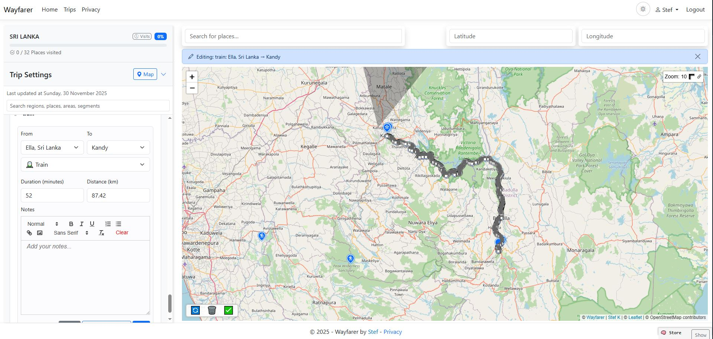

# Wayfarer

[](https://github.com/stef-k/Wayfarer/actions/workflows/tests.yml)

Wayfarer is a self-hosted travel companion for keeping a private location timeline,
planning trips, and sharing live progress with people you trust. Your location history
stays on your own server, with control over who can see it and what you publish.

## Key capabilities

- **Location timeline:** explore your history on a map, add notes, and review location statistics.
- **Trip planning:** organize regions, places, areas and routes, with notes and automatic visit detection.
- **Mobile capture:** stream GPS updates or send manual check-ins from the companion app to your server.
- **Import and export:** bring in location history and trip plans, export your data, and create printable PDF trip guides.
- **Live sharing:** follow trusted group members and optionally publish or embed timelines and trips.
- **Privacy controls:** keep timelines and trips private by default, hide sensitive areas, delay public location visibility, and enable 2FA.

See the [User Guide](docs/user/index.md) for details and workflows.

## Guided self-hosting

**Linux AMD64 and ARM64 are supported.** With Docker Engine, Compose v2 and sudo/root
access, download the small standalone `wayfarerctl` bootstrap from an official stable
[GitHub Release](https://github.com/stef-k/Wayfarer/releases). Verify its Release asset
SHA-256 and extract it in a trusted directory:

```sh
tar -xzf wayfarerctl-linux-amd64.tar.gz
chmod +x wayfarerctl
sudo ./wayfarerctl setup
```

Use `wayfarerctl-linux-arm64.tar.gz` on ARM64. The archive contains the standalone
operator. Setup discovers, downloads and verifies the matching stable deployment
bundle and immutable container images, then guides you through hostname, proxy and
administrator-password choices. You do not need to clone source or install host
.NET, Node, PostgreSQL, Nginx or Certbot for this supported Compose path.

Start with the [Self-hosting guide](docs/self-hosting/index.md) for prerequisites,
verification and guided setup. Use [Operations](docs/self-hosting/operations.md) for
routine lifecycle, backup, update and restore.

## Screenshots

[](docs/images/public-timeline.JPG)

[](docs/images/segment-edit-2.JPG)

## Ongoing operation

The same `wayfarerctl` entry point covers status, diagnosis, logs, backup, update and
restore. After setup, use its retained-release dispatch as described in
[Operations](docs/self-hosting/operations.md) and the
[wayfarerctl reference](docs/self-hosting/wayfarerctl.md).

Keep the deployment updated, use strong administrator credentials and 2FA, configure
HTTPS and trusted proxies correctly, maintain backups and practice recovery, and
choose public exposure deliberately. Keep registration closed unless you intend to
open it. Wayfarer owns its baseline application-level Identity, API and location-ingestion
admission/rate protections; optional host or proxy hardening adds defense in depth.
See [Operations](docs/self-hosting/operations.md#routine-security-checks).

## Documentation

Browse the [documentation site](https://stef-k.github.io/Wayfarer/) or follow your path:

- **Users:** [User Guide](https://stef-k.github.io/Wayfarer/user/) for accounts, Timeline, Trips, Groups, Mobile and personal providers.
- **Self-hosters:** [Self-hosting guide](https://stef-k.github.io/Wayfarer/self-hosting/) for installation, routine operation, backup, update, restore and troubleshooting.
- **Developers & Contributors:** [Developer Guide](https://stef-k.github.io/Wayfarer/development/) for local development, architecture, APIs, database and testing.
- **Project Maintainers:** [Maintainer guide](docs/maintainer/index.md) for release/version/publication ownership, lifecycle qualification and container/Compose authority.

## Mobile companion

[WayfarerMobile](https://github.com/stef-k/WayfarerMobile) connects to your server for
GPS tracking, manual check-ins and live group updates, with QR-code pairing.
See the [Mobile App guide](docs/user/mobile.md) for setup and usage.

## Development and contribution

The web app uses ASP.NET Core with PostgreSQL/PostGIS, Razor and JavaScript, plus a
Vue/Vite Trip Editor. Start with the [Developer Guide](docs/development/index.md)
for local setup, project structure, [services and jobs](docs/development/architecture.md),
[API documentation](docs/development/api.md), testing and contribution expectations.

## Project and support

This is a spare-time project with no guaranteed schedule or roadmap.
[Issues and feature requests](https://github.com/stef-k/Wayfarer/issues) and focused
pull requests are welcome; reviews and merges may take time. Include motivation,
reproduction steps where relevant, validation and documentation updates.

## Branding and license

The **Wayfarer** name and project identity refer to this repository. Forks and modified
redistributions should use a different name to avoid confusion and false association.

Wayfarer is [MIT-licensed](LICENSE.txt) and provided **as is, without warranty**.
