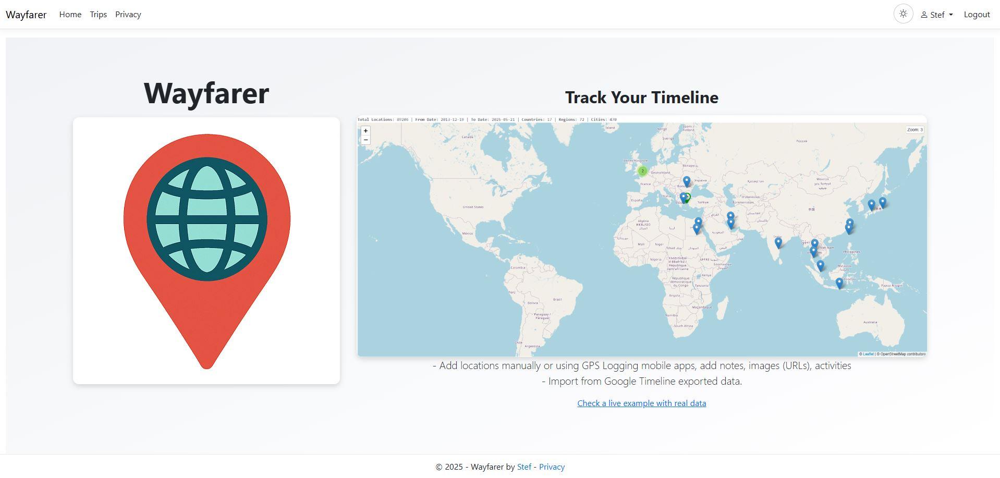
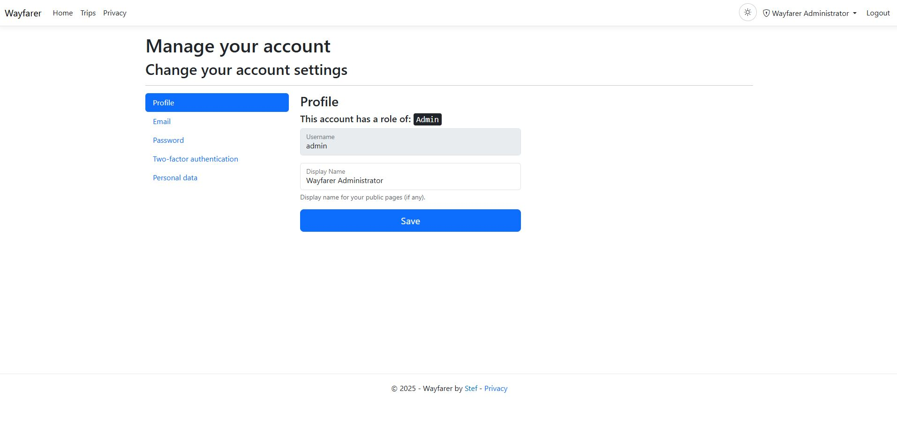
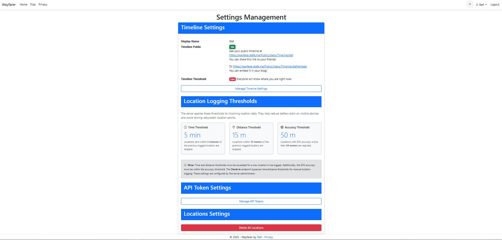
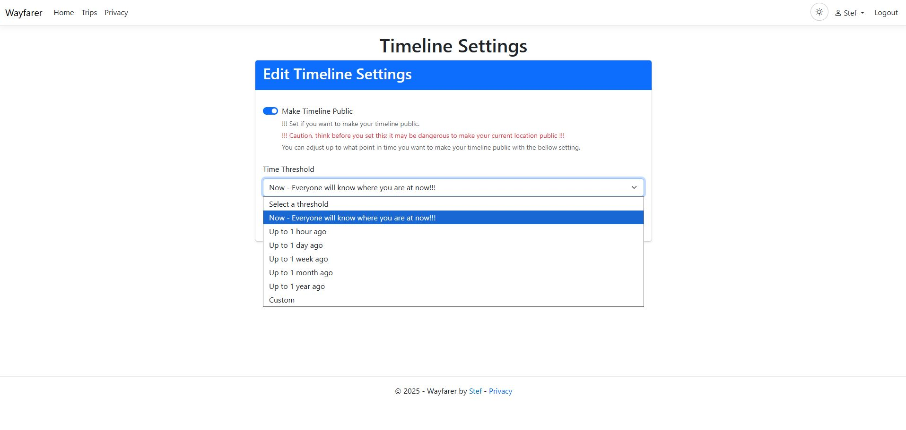
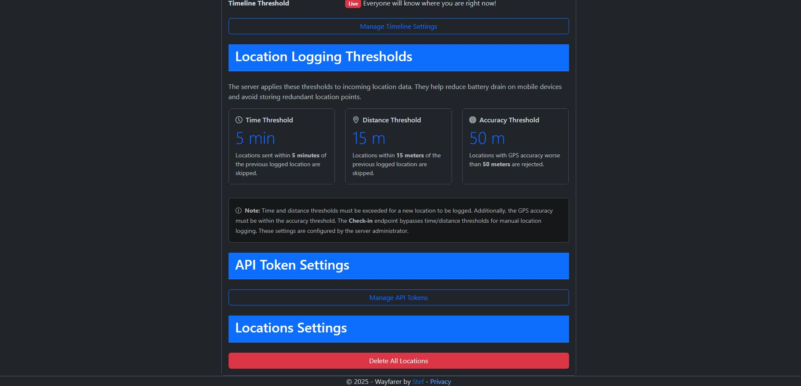
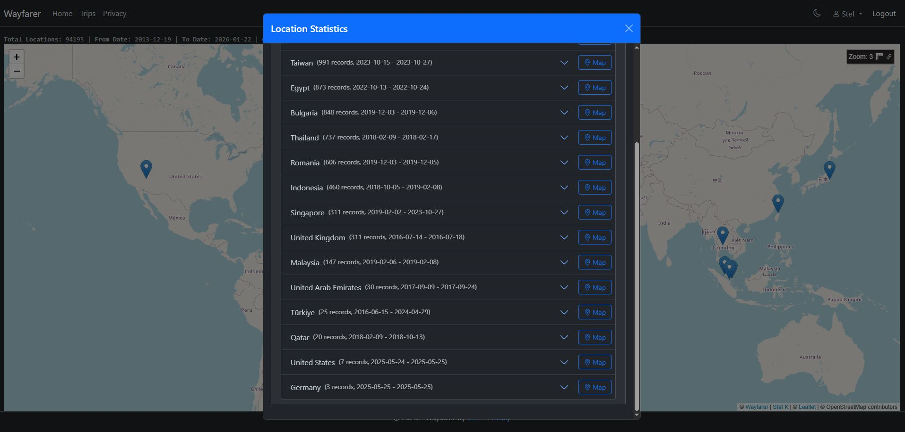

# Getting Started

This page helps you sign in, learn the layout, and understand the core concepts. Wayfarer is self-hosted; your administrator (which may be you) controls server address, user accounts, and data retention. No single global domain exists.

## Access and Accounts

- Sign In: Use the server URL provided for your installation.
- Accounts: Your admin manages registration settings. If registration is closed, ask them to create an account.
- Account basics: Usernames are the unique identifier for every account. Email addresses are not collected and there is no automated verification flow, so keep track of your credentials.
- Passwords: If your admin supplies initial credentials, change them after first login under your account settings. Two-factor authentication (2FA) is supported via the account management pages.
- Lost passwords: Ask an administrator to reset your password. Server administrators have access to password reset tools.

## Role Overview

- **Admin** — Manages settings and other accounts. Admin users do not have access to timeline features while acting as admin.
- **Manager** — Views location data for users who have explicitly trusted them (e.g., organisations or family coordinators).
- **User** — Personal account for timeline/trip features and for reporting locations from the mobile app.

## Production Password Policy

- Minimum **15 characters**.
- Requires at least one uppercase letter, one lowercase letter, one digit, and one non-alphanumeric character.
- Development uses a separate local password/seed policy; it is not the Production policy.
- Because recovery is manual, rotate credentials regularly and enable 2FA where possible.

See [Security](21-Security.md) for account, token, and server security details.

## App Layout

- Top Navigation: Switch between Dashboard, Trips, Timeline, Groups, and Admin (if you have access).
- Left/Right Panels: Context menus (filters, import, settings) depending on the page.
- Map: Interactive map with OpenStreetMap tiles (cached locally for faster loading).

## Core Concepts

- [Timeline](06-Timeline.md): Your personal location points over time (ingested from device logs or imports).
- [Trips](04-Trips.md): Structured plans composed of Regions, Places, Areas (polygons), and Segments (routes) with notes.
- [Groups](05-Groups.md): Share live or recently uploaded locations with trusted members. Owners manage membership and visibility.

## First Steps

1. Review your account profile, change your initial password, and enable 2FA.
2. Explore Timeline or create your first Trip from the menu.
3. If you have historical data, follow [Importing Data](07-Importing-Exporting.md#importing-data).
4. Optional: [connect WayfarerMobile](08-Mobile.md#getting-started) for location tracking and check-ins.
5. Optional: [configure a personal location provider](24-Personal-Location-Providers.md) for address enrichment or routing.

If you need to install your own server, start with [Install & Self-Hosting](02-Install-and-Dependencies.md), then use the [wayfarerctl operator guide](29-Wayfarerctl.md) for normal operation.

## User Settings

- Access from the user menu to configure your personal preferences.
- **Timeline settings** — configure privacy, visibility, and time thresholds.
- **API tokens** — manage tokens for mobile app and external integrations.
- **Location providers** — configure optional personal geocoding and directions profiles.
- **Dark theme** — toggle dark mode for comfortable viewing.

### Dark Theme Support

- Wayfarer includes a dark theme for comfortable viewing in low-light conditions.
- Toggle from User Settings or the theme switcher.

