# Features Overview

Wayfarer is a comprehensive self-hosted travel companion with location tracking, trip planning, and real-time sharing capabilities.

---

## Maps and Tiles

- Interactive maps via **Leaflet** with configurable tile providers.
- **Tile provider settings** (Admin > Settings):
  - Built-in presets: OpenStreetMap, Carto Light/Dark, ESRI Satellite.
  - Custom tile URL templates with API key placeholders.
  - Dynamic map attribution from active provider.
- **Local tile caching** reduces bandwidth and respects fair-use policies:
  - Zoom levels 0–8 cached permanently (~1.3–1.75 GB).
  - Higher zooms use LRU policy with configurable cap (default 1024 MB).
- **Tile rate limiting** for anonymous users (default 500 requests/minute per IP).
- Admin controls for cache statistics, cleanup, provider changes, and size limits.

---

## Location Timeline

- **Record locations** via mobile app GPS, manual check-ins, or API.
- **Import history** from Google Timeline (JSON), GPX, KML, GeoJSON, and CSV with progress tracking.
- **Import deduplication** prevents duplicate entries based on timestamp and coordinates.
- **Metadata preservation** — accuracy, speed, altitude, heading, and source tracked per location.
- **Export locations** to GeoJSON, KML, CSV, or GPX formats with full metadata.
- **Reverse geocoding** enriches coordinates with addresses when a Mapbox token is configured.
- **Wikipedia integration** — click the Wiki button on any location to see nearby Wikipedia articles; uses dual geo + text search for reliable discovery.
- **Activity types** categorize entries (walking, driving, eating, etc.).
- **Inline activity editing** — edit activity type directly from location modals and tables.
- **Bulk edit notes** to update multiple location records at once.
- **Location statistics** show visit counts by country, region, and city.
- **GPS accuracy filtering** — configurable threshold (default 50m) filters noisy readings.

---

## Privacy Controls

- **Hidden Areas** — draw polygon exclusion zones; locations inside never appear publicly.
- **Public timeline threshold** — control how recent data appears (e.g., hide last 2 hours).
- **Public/private toggle** — timeline is private by default; opt-in to share.
- **Embeddable timeline** — iframe your public timeline into other websites.

---

## Public Discovery

Visitors can browse public content without authentication:

**Trip Discovery:**
- **Search** trips by name and description.
- **Tag filtering** with "All" (must match all tags) or "Any" (match at least one) modes.
- **Popular tags** display with usage counts.
- **Sort options**: by update date or name (A-Z, Z-A).
- **View modes**: Grid layout (cards) or List layout (table).
- **Trip cards** show cover image, owner, description excerpt, tags, and stats.
- **Picture-in-Picture** map preview on hover.
- **Recent update badge** for trips updated within 7 days.
- **Quick preview** modal with full trip details.
- **Clone trips** (authenticated users can copy public trips to their account).
- **Share button** copies public trip URL to clipboard.

**Public Timeline:**
- View any user's public timeline by username.
- Interactive map with location markers.
- Location details: coordinates, address, activity, timestamp, altitude, speed.
- **Timeline statistics**: distance traveled, time spent, visit counts.
- **Embeddable** for external websites via iframe.

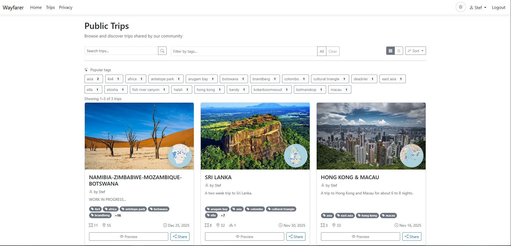

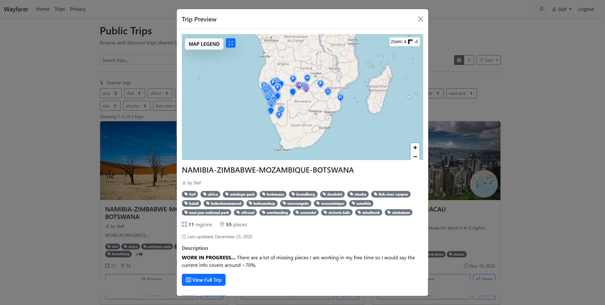

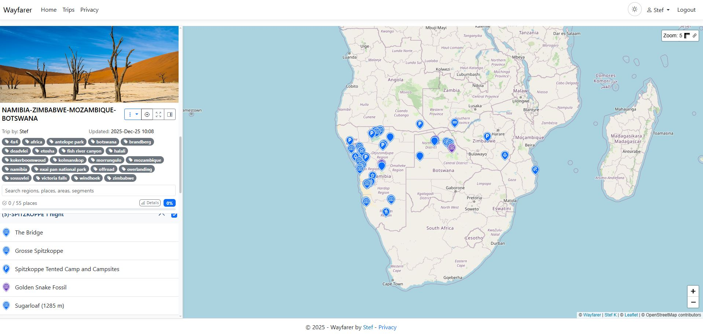

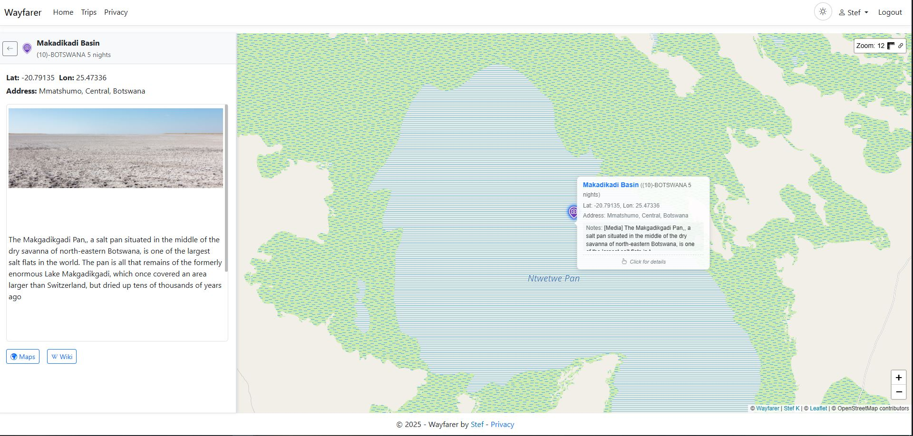

---

## Trips

- Organize trips into **Regions**, **Places** (points), **Areas** (polygons), and **Segments** (routes).
- Add **notes** (rich HTML), **colors**, **icons**, and **travel modes**.
- **Wikipedia lookup** — click the Wiki button on any place to see relevant articles via geo + text search.
- **Trip tags** for organization with public browsing by tag.
- **Cover images** for trips and regions.
- **Import trips** from Google MyMaps KML or Wayfarer format with duplicate handling.
- **Export trips** to PDF (printable guide with maps and links) or KML.
- **Public trip sharing** with optional visit progress display.
- **Trip thumbnails** auto-generated for preview cards.

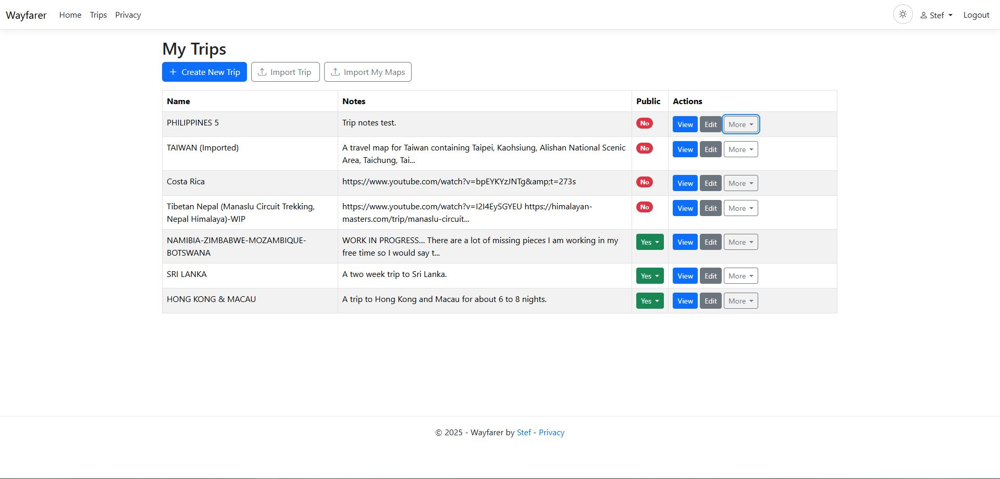

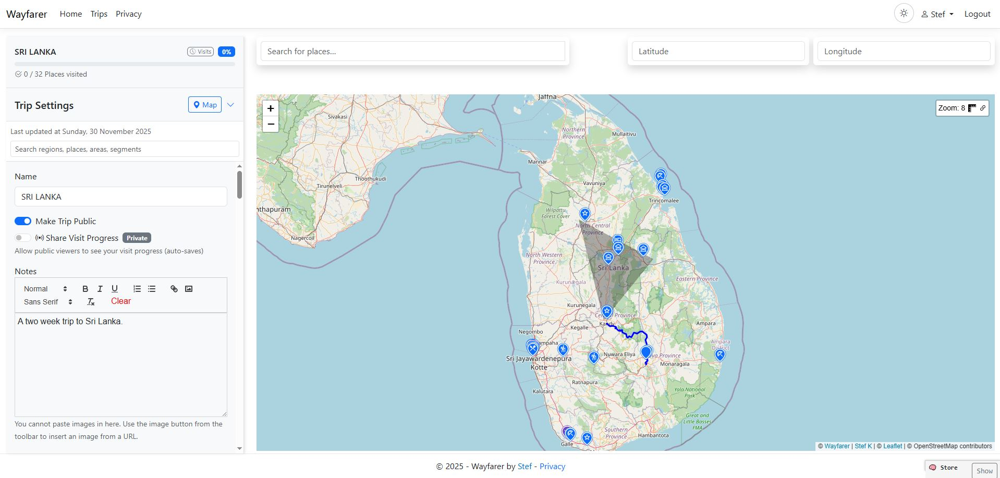

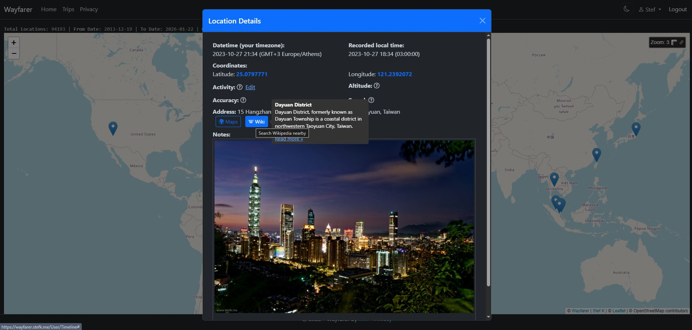

---

## Automatic Visit Detection

- Detects when GPS pings arrive near planned trip places.
- **Two-hit confirmation** reduces false positives from GPS noise.
- Records **visit events** with arrival/departure times and place snapshot data.
- **Visit management UI** to view, search, and edit visit history.
- **Visit backfill** — analyze existing location history to create visits retroactively:
  - 4-tab interface: Confirmed, Consider Also, Stale, Existing.
  - **Consider Also** suggestions catch near-miss visits with cross-tier evidence.
  - Confidence scoring based on location count, proximity, and tier hit counts.
  - **Place context map** — click any row to see place marker, contributing pings, and ruler tool.
  - Stale visit detection when places are deleted or moved.
  - Select/deselect functionality with manual visit deletion.
  - Clear All Visits option in trip menu.
- **Visit-to-location navigation** — view underlying location records from any visit.
- **Notification cooldown** — configurable delay to reduce SSE spam for repeated visits.
- Works with all location sources: mobile tracking, manual check-ins, API entries.
- Configurable detection radius, accuracy thresholds, suggestion multiplier, and confirmation requirements.

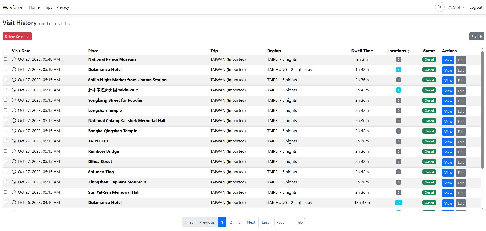

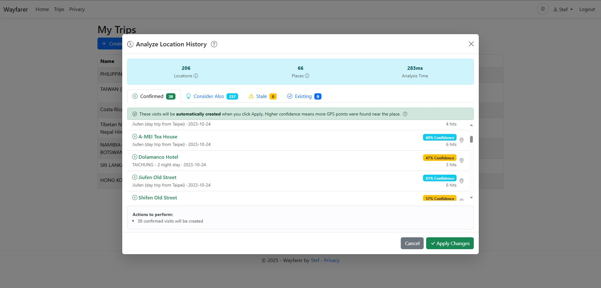

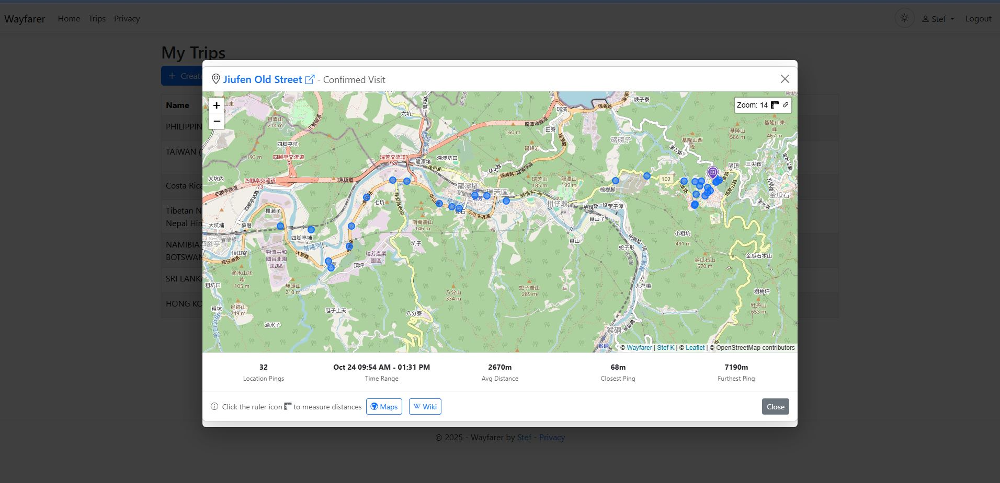

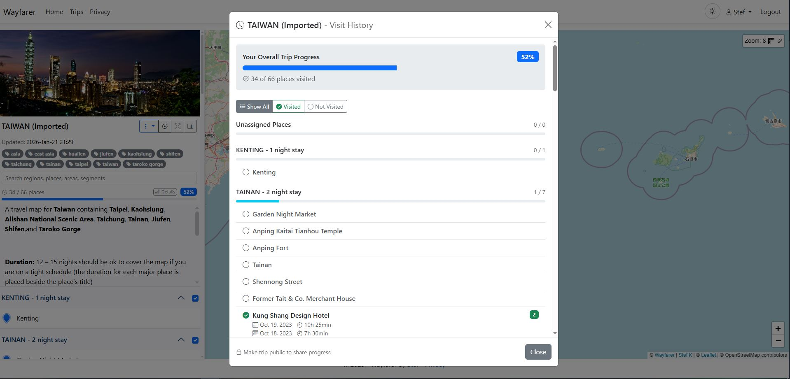

---

## Groups & Real-Time Sharing

- Create **groups** for family, friends, or teams.
- **Roles**: Owner, Manager, Member with different permissions.
- **Invitation system** with token-based acceptance.
- **Real-time location sharing** among trusted group members.
- **Organization peer visibility** settings for larger groups.
- **SSE notifications** for instant updates on locations, membership changes, and visits.

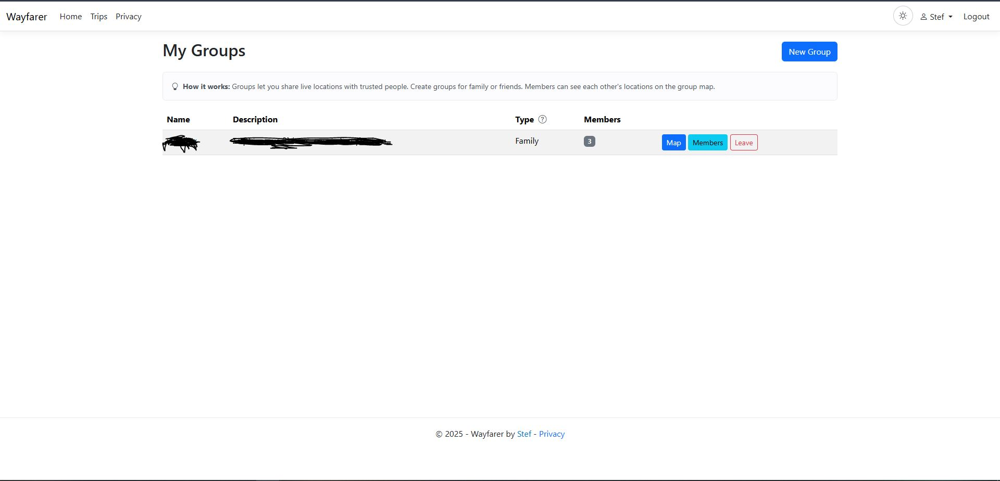

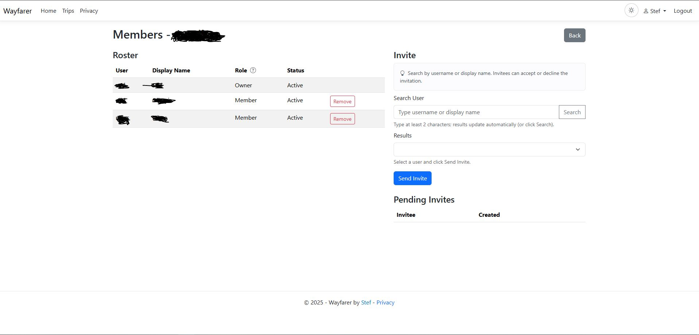

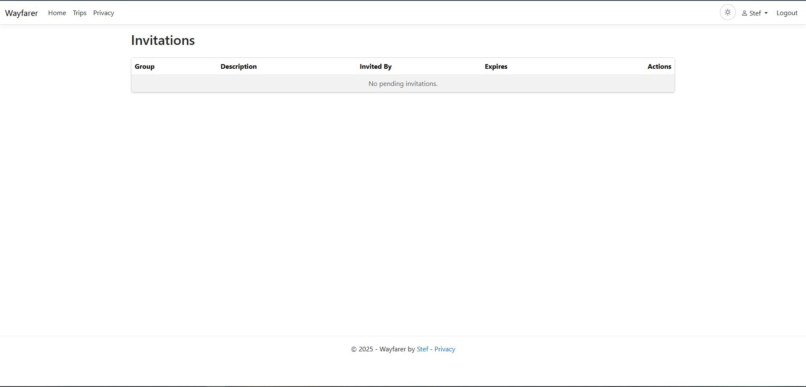

---

## Mobile App Integration

- Companion app **WayfarerMobile** (.NET MAUI) connects via API tokens.
- **Live GPS tracking** with configurable intervals.
- **Manual check-ins** for specific locations.
- **Offline map tiles** cached for use without connectivity.
- **SSE subscriptions** for real-time group updates.
- **QR code pairing** for easy server connection.

---

## Background Jobs

- **Location Import Job** — processes uploads asynchronously with progress tracking.
- **Visit Cleanup Job** — closes stale visits, removes unconfirmed candidates.
- **Audit Log Cleanup Job** — removes logs older than 2 years.
- **Log File Cleanup Job** — prunes application logs older than 1 month.
- **Job control panel** — pause, resume, cancel running jobs; view history and status.
- **SSE job status updates** — real-time monitoring in admin panel.

---

## Admin & Manager Features

**Manager capabilities** (also available to Admins):
- **User management** — create, edit, lock/unlock, assign roles (Admin, Manager, User).
- **Password management** — reset any user's password.
- **API token management** — view, create, regenerate, or revoke tokens for any user.
- **Group management** — create and manage groups, invite members, view group maps.

**Admin-only capabilities:**
- **Protected users** — first admin account is protected and cannot be deleted.
- **Application settings** — location thresholds, visit detection, upload limits, cache sizes.
- **Tile provider settings** — presets, custom templates, API keys, validation, cache purge on change.
- **GPS accuracy threshold** — filter low-quality location readings (default 50m).
- **Visit detection tuning** — required hits, radius ranges, accuracy multipliers, notification cooldown.
- **Audit logs** — track login attempts, password changes, role modifications, data exports.
- **Activity types** — manage location activity categories (69 preseeded types).
- **Job monitoring** — start, pause, resume, cancel scheduled jobs; view execution history.
- **Log viewer** — real-time log viewing with search, auto-refresh, download, and pagination.
- **Registration control** — open/close user self-registration.
- **Cache management** — view stats, clear LRU or all tiles, rate limiting for anonymous users.
- **Disk usage summary** — combined view of tile cache and upload storage.

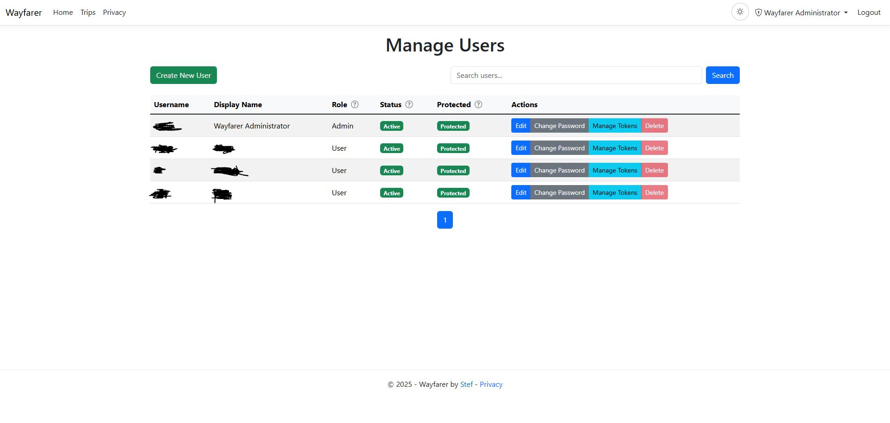

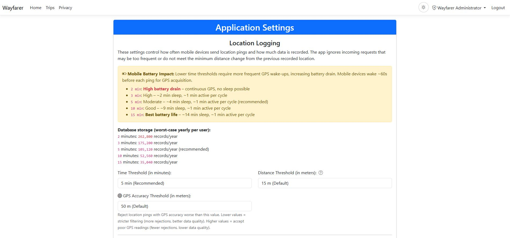

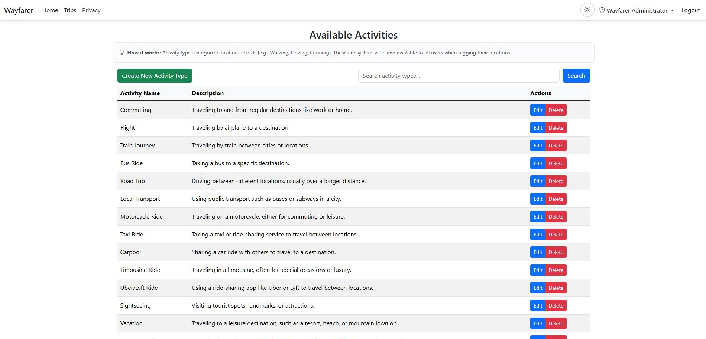

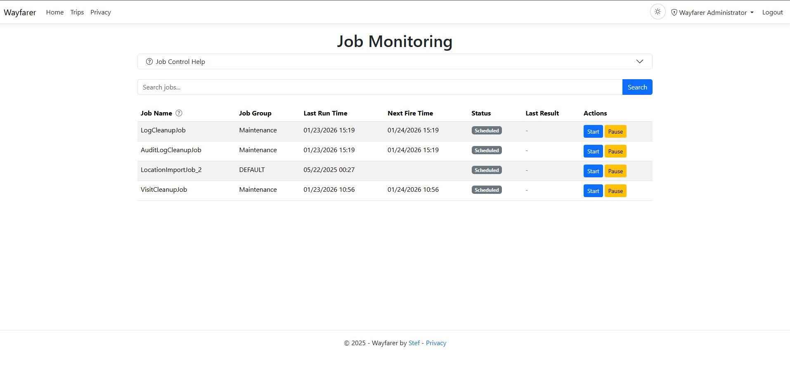

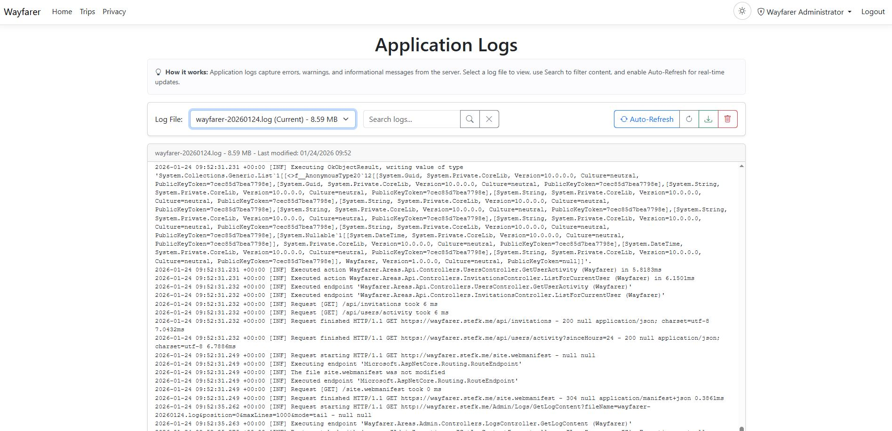

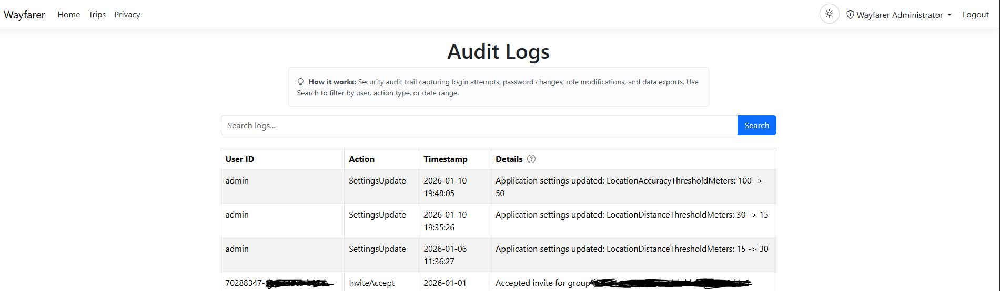

---

## API & Integration

- **RESTful API** with Bearer token authentication.
- Endpoints for trips, locations, groups, visits, invitations, settings.
- **SSE streams** for real-time updates (locations, groups, visits, jobs).
- **Mobile-specific endpoints** optimized for app usage.
- **Rate limiting** and threshold enforcement to prevent spam.

---

## Technology Stack

| Layer | Technology |
|-------|------------|
| Backend | ASP.NET Core 10 MVC, Quartz.NET |
| Database | PostgreSQL + PostGIS via EF Core |
| Spatial | NetTopologySuite, GiST indexes |
| Frontend | Razor views, Leaflet, vanilla JS |
| Bundling | [MvcFrontendKit](https://github.com/nickofc/MvcFrontendKit) (esbuild) |
| Map Icons | [wayfarer-map-icons](https://github.com/stef-k/wayfarer-map-icons) |
| Real-time | Server-Sent Events (SSE) |
| PDF Export | Microsoft Playwright |
| Geocoding | Mapbox API (optional) |
| Auth | ASP.NET Identity with 2FA |
| Logging | Serilog (console, file, DB) |
| Testing | xUnit |
