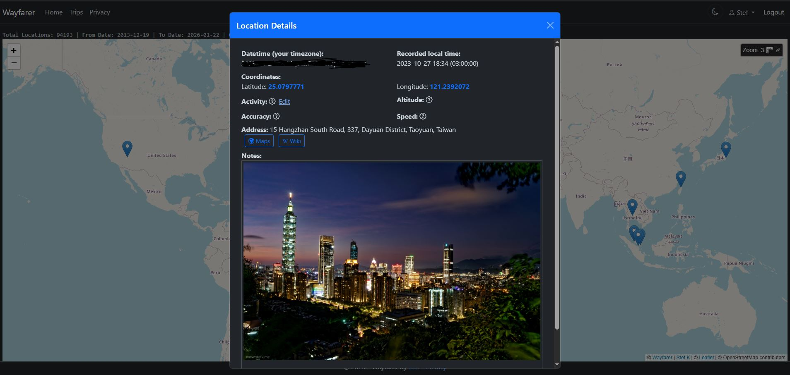
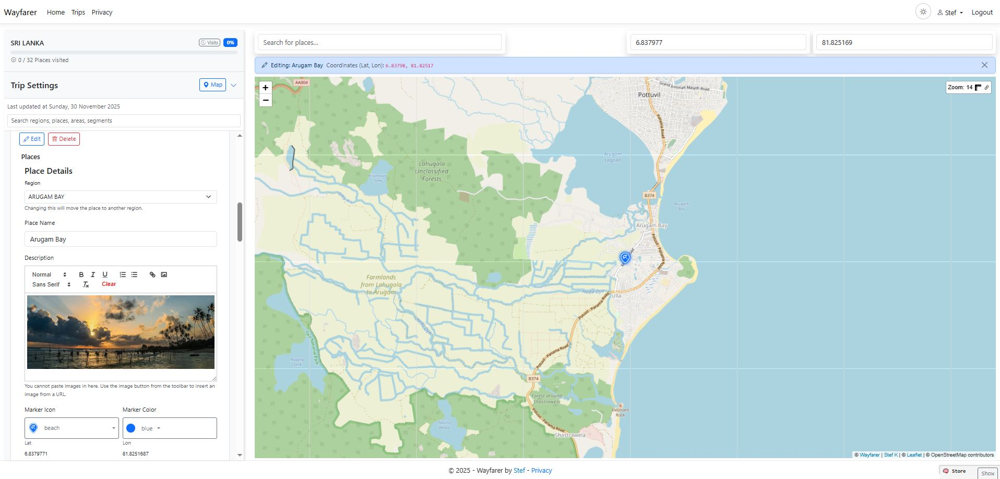
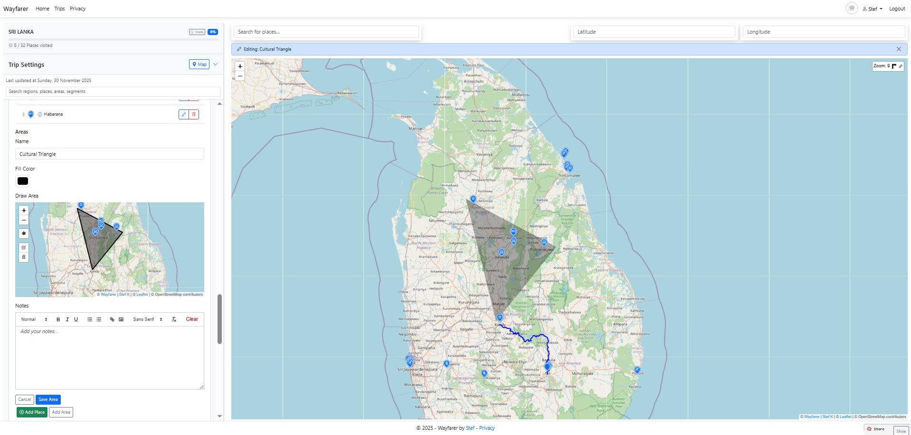
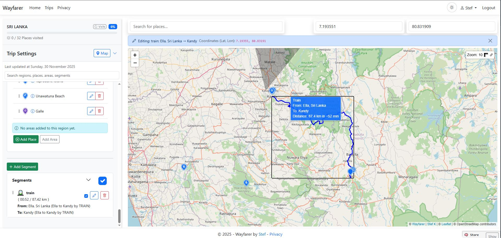
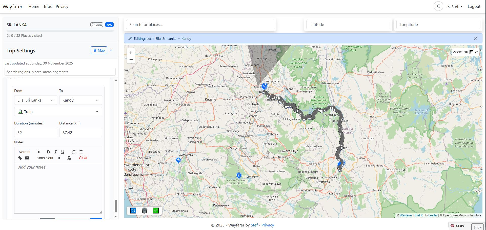
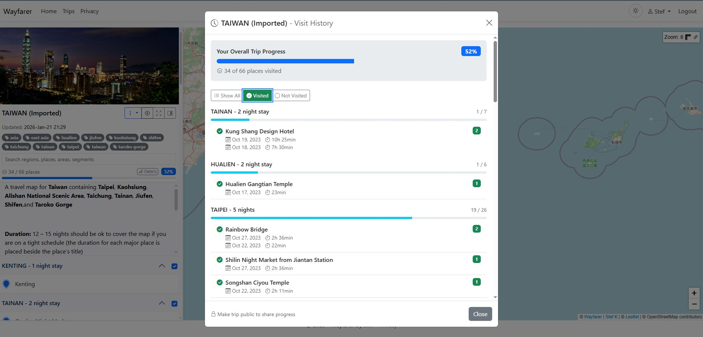

# Trips

Trips are the core trip planning feature in Wayfarer, allowing you to organize destinations, routes, and detailed travel information.

---

## Trip Structure

A Trip contains a hierarchy of elements:

- **Regions** — logical groupings of places (e.g., cities, areas of interest)
- **Places** — specific points of interest with coordinates and notes
- **Areas** — polygonal zones drawn on the map
- **Segments** — routes connecting places with travel mode information

Trips are **private by default**; you can make them public to share with others.

---

## Creating a Trip

1. Open **Trips** and click **New**.
2. Name your trip and save.
3. Toggle **public/private** at any time.
4. Add a **cover image** for visual identification in trip lists.

---

## Regions and Places

- Add a **Region** to organize related places.
- Add **Places** as points with:
  - Coordinates (lat/lon)
  - Notes (rich HTML supported)
  - Icon and marker color
  - Travel mode
- **Wikipedia lookup** — click the Wiki button on any place to discover related articles via geo + text search.
- **Areas** (polygons) highlight zones; draw them directly on the map.

---

## Segments (Routes)

- Add **Segments** between Places.
- Choose **travel mode** (walking, driving, transit, etc.).
- Add notes and route geometry if available.
- Segments display as connected lines on the map.

---

## Trip Tags

- Add **tags** to trips for organization and discovery.
- Tags use case-insensitive matching.
- Public trips can be browsed by tag.
- Manage tags from the trip edit page.

---

## Trip Thumbnails

- Trips automatically generate **map thumbnail previews**.
- Thumbnails appear in trip lists and cards.
- Thumbnails update when trip content changes.

---

## Importing Trips

Import trips from external sources:

- **Google MyMaps KML** — import your Google MyMaps designs directly.
- **Wayfarer KML** — reimport trips exported from Wayfarer.
- Duplicate detection with configurable handling modes.
- Imports preserve regions, places, areas, and segments.

---

## Exporting Trips

### PDF Guide

Printable trip guide with interactive features:

- **Clickable place names** — link to Google search
- **Clickable coordinates** — link to Google Maps
- Map snapshots for overview, regions, places, and segments
- Complete trip details including notes, travel modes, distances
- **Cancel export** at any time during generation
- SSE progress updates during generation

### KML Export

- **Wayfarer format** — preserves all metadata for reimport
- **Google MyMaps format** — compatible with Google MyMaps

---

## Automatic Visit Detection

When you receive GPS pings (from the mobile app, API, or manual entries), the system automatically detects visits to your planned places.

### How It Works

1. GPS ping arrives within configured radius of a trip place.
2. **Two-hit confirmation** — a second ping confirms the visit (reduces false positives from GPS noise).
3. A **visit record** is created with:
   - Arrival time
   - Departure time (when you leave or timeout)
   - Place snapshot (name, location, notes preserved even if the place is later deleted)
   - Trip and region context

### Visit Management

- View visit history from **User > Visits**.
- **Search filters:**
  - Date range (from/to dates)
  - Trip filter (select specific trip)
  - Status filter: All, Open (still visiting), Closed
  - Place name search
  - Region filter
- **Visit table columns:**
  - Visit Date
  - Place and Trip name
  - Region
  - **Dwell Time** — duration spent at the location
  - **Locations** — count of GPS pings that contributed to the visit
  - Status (Open/Closed)
- Edit or delete individual visits.
- **Bulk delete** — select multiple visits and delete at once.
- **Visit-to-location navigation** — click to view the underlying location records that triggered a visit.
- Visit data persists independently of trip changes (place snapshots preserved).

### Visit Backfill

Analyze your existing location history to create visits retroactively for trip places you've already passed through.

**How to use:**

1. Open a trip and select **Backfill Visits** from the dropdown menu.
2. Optionally set a date range to limit the analysis period.
3. Click **Analyze** to scan your location history against all trip places.
4. Review the preview across four tabs:
   - **Confirmed** — high-confidence visits detected from your location history (select which to create).
   - **Consider Also** — near-miss suggestions that didn't meet full confirmation thresholds but show evidence of proximity; useful for catching visits with sparse GPS data.
   - **Stale** — existing visits where the place was deleted or moved beyond detection radius.
   - **Existing** — visits already recorded (can be deleted if needed).
5. Use **Select All / Deselect All** to quickly manage selections within each tab.
6. Review the **Action Summary** showing what will happen on Apply.
7. Click **Apply** to create selected visits and delete selected stale/existing visits.

**Place context map:**

Click any visit row to open a context map modal showing:
- The place marker at its configured location.
- Location pings that contributed to the match.
- Ping tooltips with timestamp, accuracy, and distance details.
- A ruler measurement tool for manual distance checks.
- Auto-fit bounds to show all relevant data.

**Confidence scoring:**

- Each potential visit receives a confidence score based on:
  - Number of location pings within the detection radius.
  - Proximity to the place center.
  - Multiple detection zones that catch visits even with imprecise GPS data.
- Higher confidence indicates more reliable visit detection.
- **Consider Also** suggestions catch visits that narrowly missed standard thresholds using nearby location evidence.

**Clear All Visits:**

- Use **Clear All Visits** from the trip dropdown to remove all visit records for a trip.
- Useful when reimporting or restructuring trip data.

### Configuration

Adjust in **Admin > Settings**:

- Detection radius (meters)
- Accuracy thresholds
- Confirmation window (derived from location threshold)
- End-visit timeout
- **Notification cooldown** — minimum delay between visit notifications for the same place (reduces SSE spam when moving in and out of a place boundary)
- **Suggestion radius multiplier** — controls the outer search radius for "Consider Also" suggestions (default 50×, configurable 2–100×); the admin panel shows derived tier radii based on this setting

---

## Public Trip Sharing

- Make trips public to share via URL.
- Toggle **Share Visit Progress** to display your journey on public trips.
- Viewers see your progress in real-time via SSE updates.

### Visit Progress UI

When editing a trip, the progress header shows:

- **Progress bar** with percentage of places visited.
- **Visit count** (e.g., "12 of 45 places visited").
- **Visit History button** opens a detailed modal:
  - Overall progress summary with percentage.
  - Filter buttons: Show All, Visited Only, Not Visited.
  - Region-by-region breakdown with per-place visit status.
  - Visit details including dates and dwell time.
  - Share Progress option to copy public URL.

---

## Tips

- Keep names concise for cleaner export filenames.
- Use **Areas** for boundaries and **Segments** for movement between Places.
- Add cover images for visual organization.
- Use tags to group related trips.

