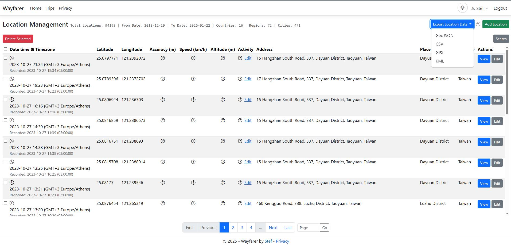
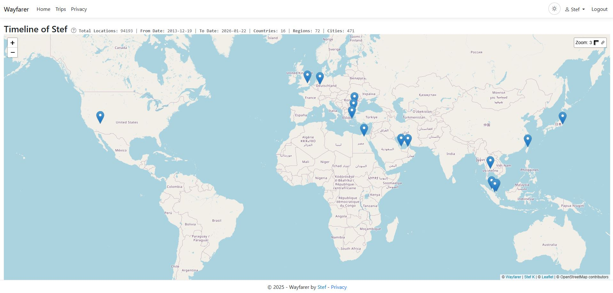
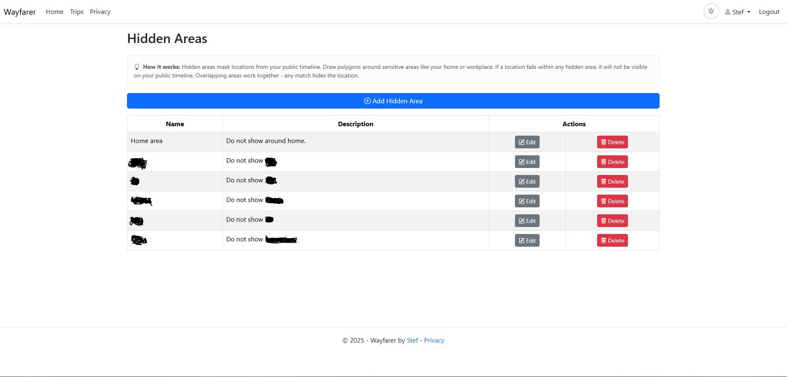
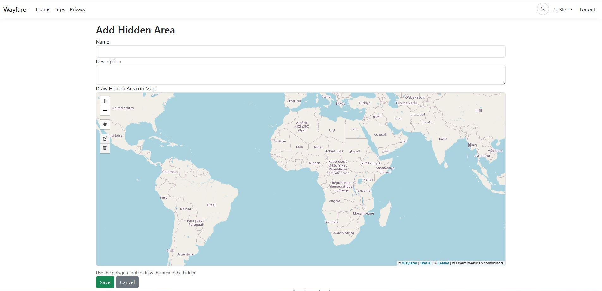
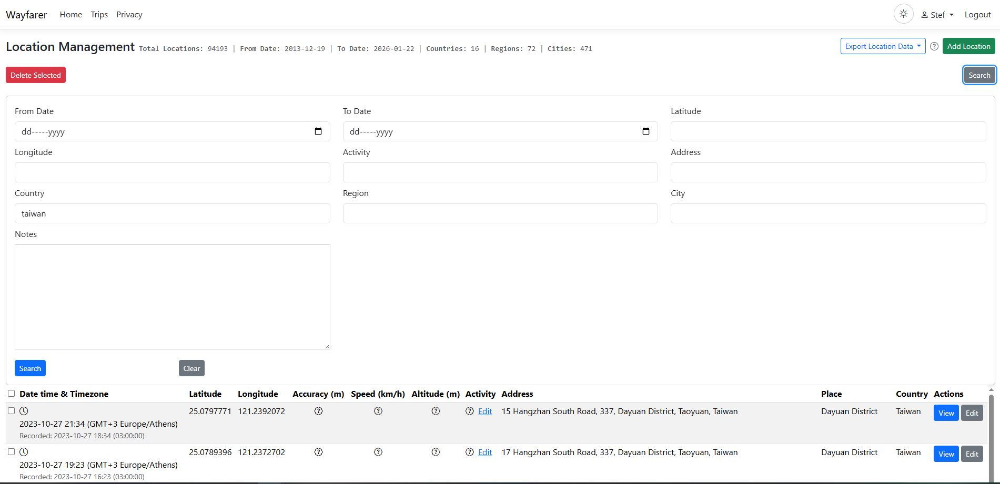
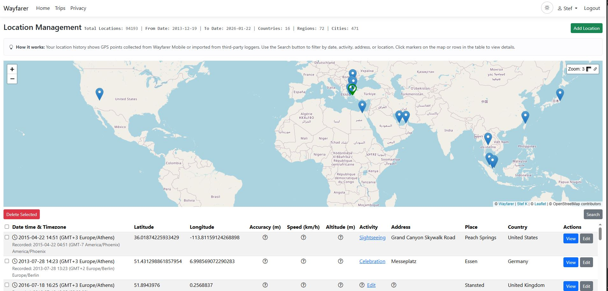
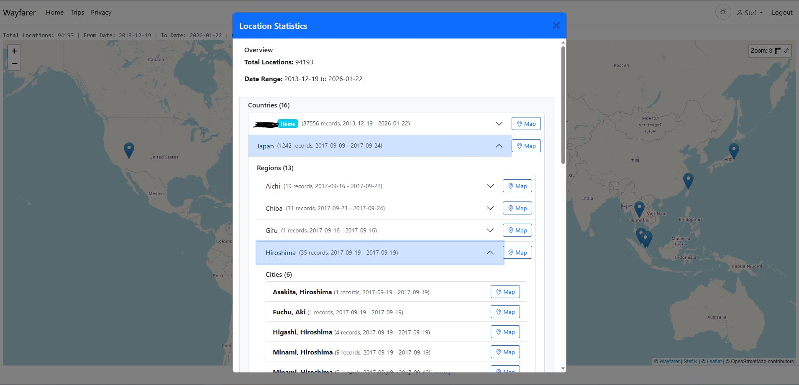
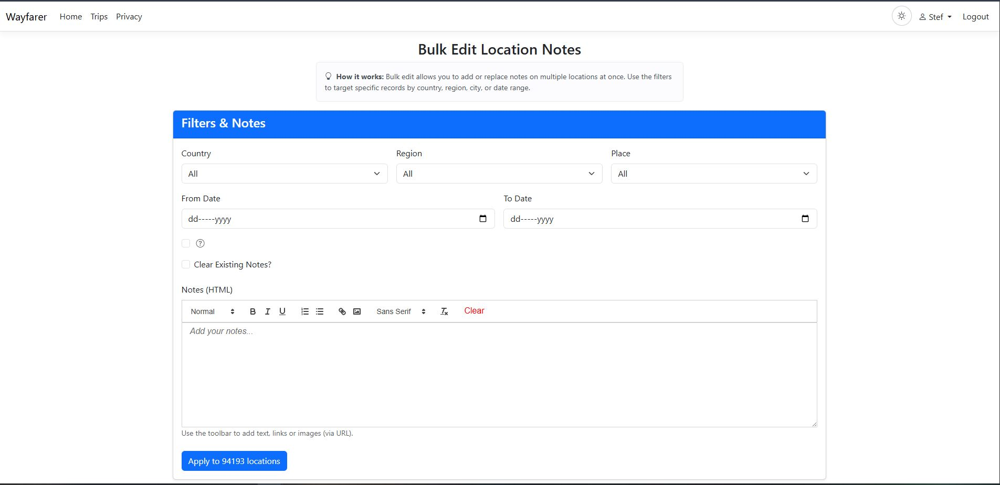

# Timeline (Public/Private, Hidden Areas, Embed)

Private vs Public
- Your timeline is private by default. You can make it public to share on the web.
- When public, visitors can view your timeline via a public URL. You can set a time threshold (e.g., hide the most recent hours/days).

Time Threshold Options
- Preset values: Now (live), 1 hour, 1 day, 1 week, 1 month, 1 year.
- Custom threshold using format: `y` (years), `m` (months), `d` (days), `h` (hours).
- Examples: `1m` (1 month), `2w` (2 weeks), `1.5d` (1.5 days), `6h` (6 hours).

Hidden Areas
- You can draw Hidden Areas so locations inside them never appear on your public timeline.
- Manage from: User > Hidden Areas. Create, edit, or delete polygons that hide sensitive places.

Embed Your Public Timeline
- Use the embed URL to include your public timeline in another site:
- Example: `<iframe src="https://<your-server>/Public/Users/Timeline/<username>/embed" width="100%" height="600" frameborder="0"></iframe>`
- Replace `<your-server>` and `<username>` with your instance and username.

Stats
- Public endpoints also provide aggregated stats for your username to support simple "about me" blocks.

Recording Modes & Data Footprint
- High accuracy: logs every ~1.5 minutes when movement exceeds ~5 m. Expect roughly 432 MB of storage per user per year when notes average 250 words.
- Mid accuracy (default): logs every ~5 minutes when movement exceeds ~15 m. Typical storage is ~129.5 MB per user per year with similar notes.
- Low accuracy: logs every ~10 minutes when movement exceeds ~50 m. Storage trends around 64.9 MB per user per year.
- Use Admin → Settings to tune the distance/time/accuracy thresholds to balance fidelity with database growth.

GPS Accuracy Filtering
- Location pings with poor GPS accuracy can be filtered out automatically.
- Configure the **GPS Accuracy Threshold** in Admin → Settings (default: 50 meters).
- Readings with accuracy values exceeding this threshold are rejected at the API level.
- Helps reduce noise from indoor/urban canyon readings while preserving quality data.
- Users can view their effective threshold in User → Settings.

Inline Activity Editing
- Edit a location's activity type directly from the location popup or table row.
- Click the activity dropdown to switch between available types without opening a full edit form.
- Changes save automatically when a new activity is selected.

Location Search & Filters
- **Date range** — filter by from/to dates.
- **Coordinate search** — find locations near specific latitude/longitude.
- **Activity filter** — filter by activity type (walking, driving, etc.).
- **Address search** — search by address text.
- **Geographic filters** — filter by country, region, or city.
- **Notes search** — find locations containing specific text in notes.

Bulk Edit Notes
- From Locations > Bulk Edit Notes, you can search by filters and update notes for many records at once.

Wikipedia Search
- Click the **Wiki** button on any location to discover related Wikipedia articles.
- Uses dual search strategy: geosearch (nearby coordinates) combined with text search (place name) for reliable results.
- Hover to see an article summary with excerpt and link to the full Wikipedia page.
- Works in location popups, modals, and trip place views.

Location Metadata
- Each location record can store additional metadata:
  - **Accuracy** — GPS accuracy in meters
  - **Speed** — movement speed at time of recording
  - **Altitude** — elevation above sea level
  - **Heading** — compass bearing
  - **Source** — origin of the data (mobile app, import, API)
- Metadata is preserved during import/export operations.
- View metadata in location details and edit modals.
