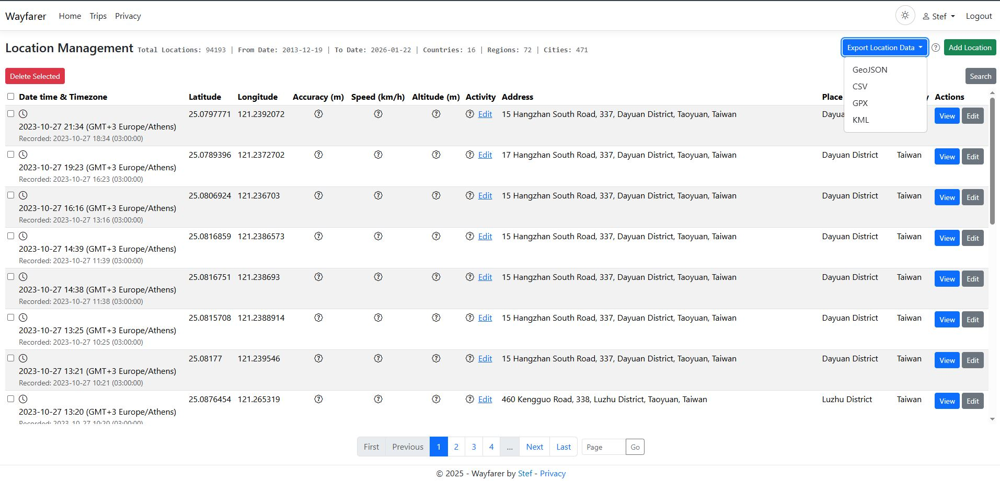
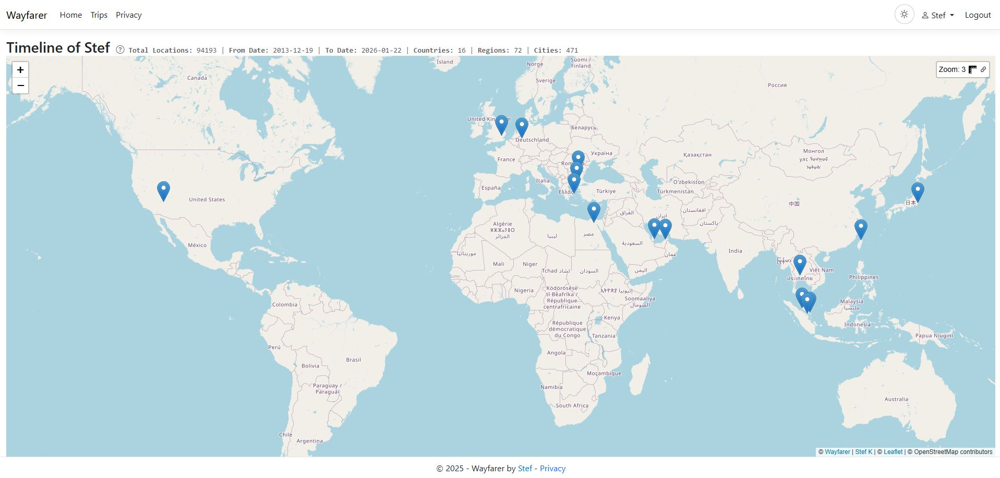
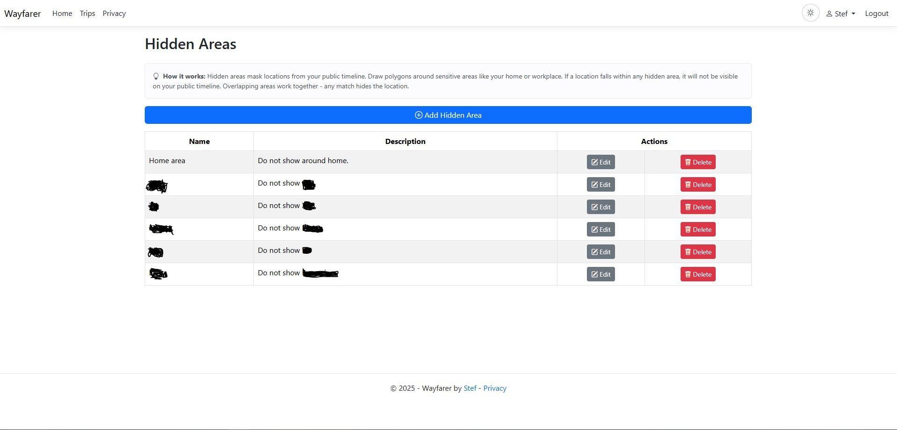
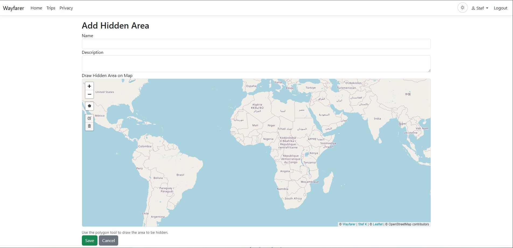
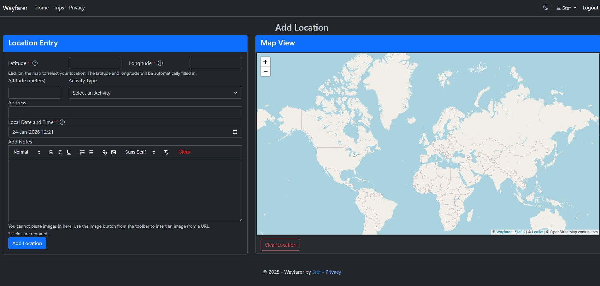
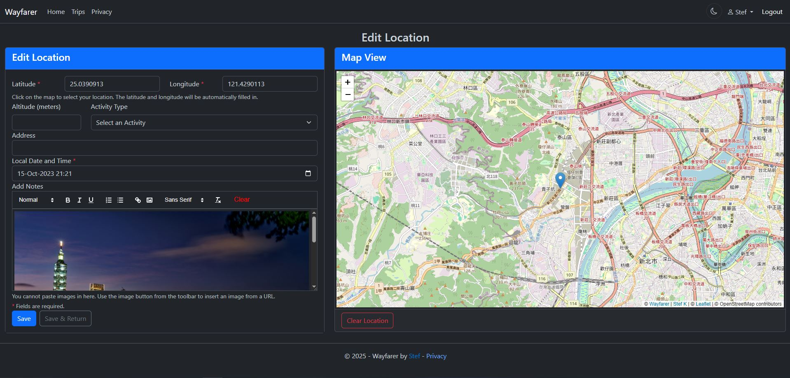
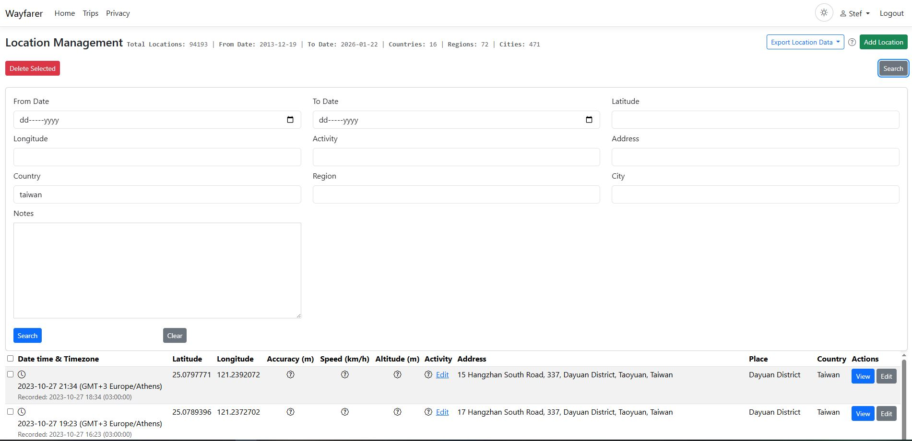
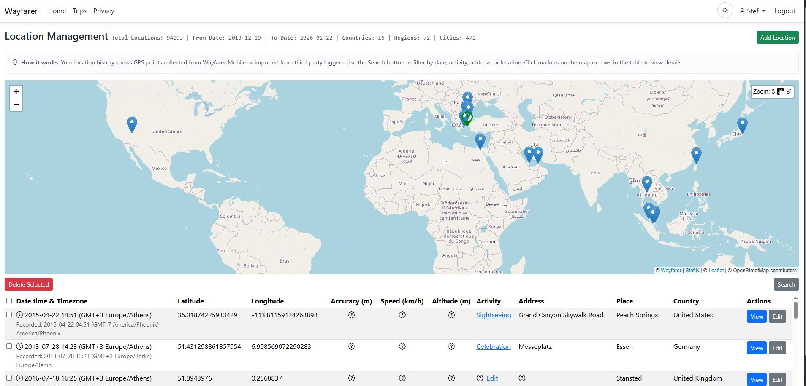
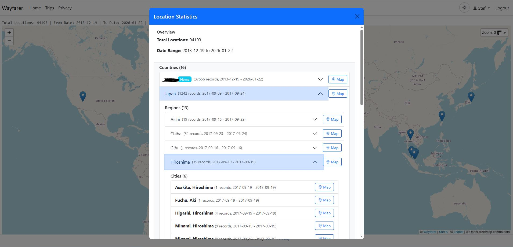
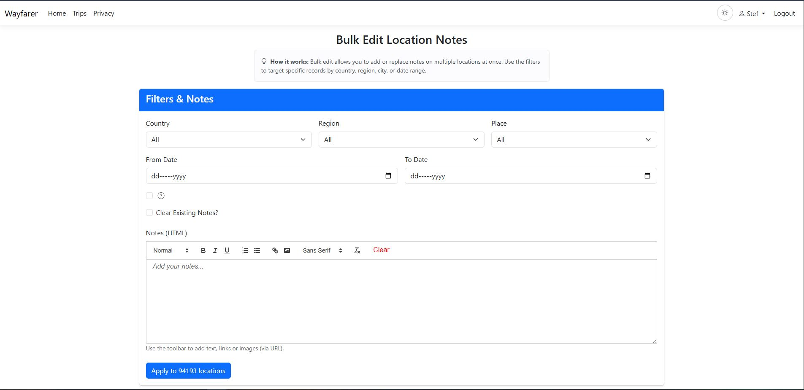

# Timeline (Public/Private, Hidden Areas, Embed)

Private vs Public
- Your timeline is private by default. You can make it public to share on the web.
- When public, visitors can view your timeline via a public URL. You can set a time threshold (e.g., hide the most recent hours/days).

Time Threshold Options
- Preset values: Now (live), 1 hour, 1 day, 1 week, 1 month, 1 year.
- Custom threshold using format: `y` (years), `m` (months), `d` (days), `h` (hours).
- Examples: `1m` (1 month), `2w` (2 weeks), `1.5d` (1.5 days), `6h` (6 hours).

Hidden Areas
- You can draw Hidden Areas so locations inside them never appear on your public timeline.
- Manage from: User > Hidden Areas. Create, edit, or delete polygons that hide sensitive places.

Embed Your Public Timeline
- Use the embed URL to include your public timeline in another site:
- Example: `<iframe src="https://<your-server>/Public/Users/Timeline/<username>/embed" width="100%" height="600" frameborder="0"></iframe>`
- Replace `<your-server>` and `<username>` with your instance and username.

Stats
- Public endpoints also provide aggregated stats for your username to support simple "about me" blocks.

Recording Modes & Data Footprint
- High accuracy: logs every ~1.5 minutes when movement exceeds ~5 m. Expect roughly 432 MB of storage per user per year when notes average 250 words.
- Mid accuracy (default): logs every ~5 minutes when movement exceeds ~15 m. Typical storage is ~129.5 MB per user per year with similar notes.
- Low accuracy: logs every ~10 minutes when movement exceeds ~50 m. Storage trends around 64.9 MB per user per year.
- Use Admin → Settings to tune the distance/time/accuracy thresholds to balance fidelity with database growth.

GPS Accuracy Filtering
- Location pings with poor GPS accuracy can be filtered out automatically.
- Configure the **GPS Accuracy Threshold** in Admin → Settings (default: 50 meters).
- Readings with accuracy values exceeding this threshold are rejected at the API level.
- Helps reduce noise from indoor/urban canyon readings while preserving quality data.
- Users can view their effective threshold in User → Settings.

Adding & Editing Locations
- **Add Location** — manually add a location point with coordinates, timestamp, activity type, and notes.
- **Edit Location** — update any location's details including coordinates, timestamp, activity, and notes.
- Access via the location popup or the Locations table.

Inline Activity Editing
- Edit a location's activity type directly from the location popup or table row.
- Click the activity dropdown to switch between available types without opening a full edit form.
- Changes save automatically when a new activity is selected.

Location Search & Filters
- **Date range** — filter by from/to dates.
- **Coordinate search** — find locations near specific latitude/longitude.
- **Activity filter** — filter by activity type (walking, driving, etc.).
- **Address search** — search by address text.
- **Geographic filters** — filter by country, region, or city.
- **Notes search** — find locations containing specific text in notes.

### Statistics grouping

Statistics use recorded Country, Region and Place labels at read time. Only outer
ASCII space (U+0020) and U+0009–U+000D are trimmed; null and empty results are
missing. Case, accents, Unicode composition, internal whitespace and punctuation
remain significant. Countries group by country; regions by country and region;
settlements by country, region and place. Missing parents are separate from named
parents and are never inferred. Summary counts equal the corresponding detailed
group counts; Total Locations includes every record in the selected scope.

The single geographic correction maps **East Macedonia and Thrace** to
**Eastern Macedonia and Thrace** only under the exact trimmed country **Greece**,
regardless of provider, manual entry or import origin. Other countries and
spellings remain unchanged. Sources checked 2026-09-05:

- [European Commission demographic-observatory project](https://reforms-investments.ec.europa.eu/technical-support-instrument-0/labour-market-and-social-protection/supporting-greece-establish-demographic-observatory-through-evidence-based-tools_en)
- [Region of Eastern Macedonia and Thrace official website](https://www.pamth.gov.gr/en/)
- [European Commission JRC regional report](https://publications.jrc.ec.europa.eu/repository/handle/JRC100503)

These sources support the English label variation, not the identity of individual
stored records. Parent scoping may increase visited counts; this region correction
may decrease them. The existing API contracts, including released Mobile counts,
are unchanged. Original labels, retained provider address lines, FullAddress and
feature metadata are not rewritten, and this correction adds no migration or
provider requests.

Both User Timeline statistics views show children without recorded parents under
presentation-only **Country not recorded** and **Region not recorded** sections.
These sections do not add geographic entities or visited counts. Existing map links
still navigate to averaged country/region coordinates or one settlement visit.

All-time visits use Timestamp; date windows use LocalTimestamp with inclusive
bounds. Visits and dates aggregate across corrected membership. Coordinate-average
inputs are ordered by Location ID. A settlement uses its latest relevant timestamp,
then highest Location ID to break ties. Countries sort by home status, visit count,
then ordinal name; regions and settlements sort by their ordinal parent/name tuples.
The home-country threshold remains the maximum of 40% of all records and three times
the mean recorded-country visit count.

Statistics labels are not new search identifiers. Search, Bulk Edit Notes,
cascading choices, preview and update membership retain their existing semantics.
The string-only limitation remains: settlements with identical names and recorded
parents cannot be distinguished, and other alternate labels may still split one
entity. Historical Place/Region administrative ambiguity is not resolved.

Bulk Edit Notes
- From Locations > Bulk Edit Notes, you can search by filters and update notes for many records at once.

Wikipedia Search
- Click the **Wiki** button on any location to discover related Wikipedia articles.
- Uses dual search strategy: geosearch (nearby coordinates) combined with text search (place name) for reliable results.
- Hover to see an article summary with excerpt and link to the full Wikipedia page.
- Works in location popups, modals, and trip place views.

Location Metadata
- Each location record can store additional metadata:
  - **Accuracy** — GPS accuracy in meters
  - **Speed** — movement speed at time of recording
  - **Altitude** — elevation above sea level
  - **Heading** — compass bearing
  - **Source** — origin of the data (mobile app, import, API)
- Metadata is preserved during import/export operations.
- View metadata in location details and edit modals.

## Location addresses and mapped features

Locations with a valid retained Geoapify enrichment tuple show structured street/number, postcode/settlement, region and country groups. Missing components and exact duplicate values are omitted, while Unicode and meaningful text are preserved. This also applies to imported valid tuples and historical Geoapify data regardless of the currently selected provider. Historical locality/region text is not silently corrected.

A partial address without street says **Street address unavailable**. With no usable components, **Address details unavailable** precedes any retained **Provider display text**. A smaller secondary line identifies a **Nearby mapped feature** for buildings/amenities, **Mapped area** for broader results, or **Mapped feature** otherwise. A nearby business is not evidence of a visit, occupancy or exact position. Broader results retain their precision notice even without a feature name.

Manual, Mapbox and unknown-provenance Locations retain their existing address preference. Address links continue targeting the recorded coordinates. The Location edit summary uses the same formatting; editing address values clears provider attribution and the retained provider-only line. No historical correction job or extra provider request is performed.
