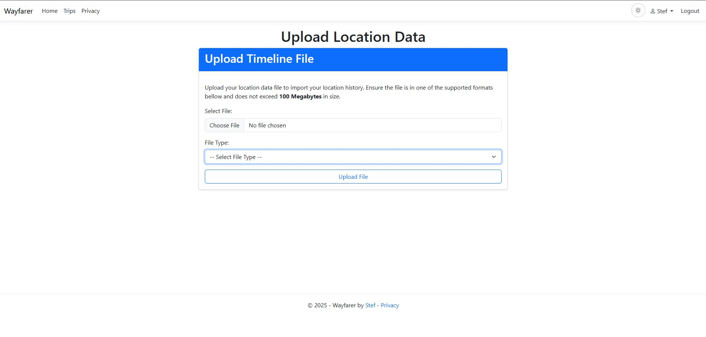
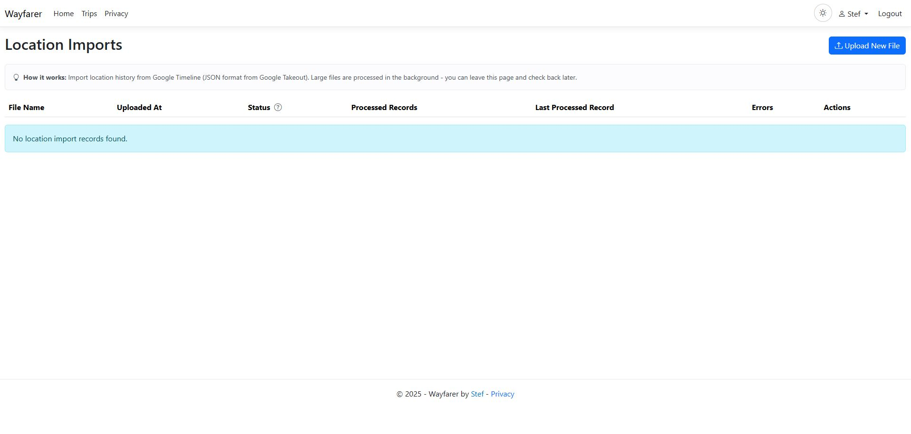

# Importing & Exporting Data

## Offline queue recovery

Queue means pending mobile delivery, Timeline means phone-local history, and Wayfarer means confirmed server history. A recovery export never clears the queue.

Full recovery needs two manual imports: prepare recovery on the original phone (suspend delivery and wait for active work), export eligible rows, import the file into the replacement phone's Timeline, import the same file into Wayfarer, verify both independently, then **Resume and reconcile** if the original queue remains. Timeline import does not update Wayfarer or recreate queue state; Wayfarer import does not populate the phone Timeline.

For expedited synchronization use **Prepare/suspend → Export → Import into Wayfarer → Resume and reconcile**. Let import reach a terminal result first. Authenticated per-user GUID identity reuses already imported rows; missing rows upload normally. Partial/failed import must be inspected or retried, never followed by queue clearing. Confirmed queue rows become synced and follow ordinary retention.

CSV uses the CSV importer and suits spreadsheets/Python. Wayfarer GeoJSON uses the Wayfarer GeoJSON importer and suits GIS tools. Both carry the portable GUID; editing/removing it can prevent exact reconciliation. Files can contain precise positions/times, Notes, activity/check-in data, device/app/OS/provider/battery metadata, queue diagnostics, and identifiers. Store and transfer them securely, retain them until both histories are verified, then delete unnecessary copies.

---

## Retained Location address data

Backend GeoJSON, CSV, GPX and KML history exports/imports preserve optional `ProviderAddressLine1` (GPX `providerAddressLine1`) alongside existing address strings. Older files remain accepted. The line is independently supplied provider display text, not a synthesized street address. Imports retain supplied values without silently correcting history; valid imported Geoapify enrichment tuples receive the same Location presentation as other valid retained tuples. A tuple is not verified capture origin.

Released Mobile continues using `FullAddress`. Its existing fields remain compatible, but old Mobile offline export/import cannot promise to retain the unknown additive field. Trip Place remains `FullAddress`-preferred and has no new provider-line field.

## Importing Data

### Supported Formats

- **GPX** — GPS tracks and waypoints
- **KML** — Google Earth/Maps format
- **CSV** — Tabular points with lat/lon (headers required)
- **Wayfarer GeoJSON** — Wayfarer location-history exports; generic GeoJSON is not supported
- **Google Timeline JSON** — Export from Google location history

### How Imports Work

- Upload a file via the import interface.
- A background job parses your file in batches.
- **Deduplication** — imports automatically detect and skip duplicate locations based on timestamp and coordinates within a small tolerance.
- **Metadata preservation** — accuracy, speed, altitude, heading, and source fields are imported when available.
- Missing addresses are enriched only after explicit upload opt-in or a later **Start** command, and only while current provider authority permits contact.
- Progress updates show status and last imported record.

### Import Controls

- **Start** — begin or resume processing a stopped/failed import.
- **Stop** — pause an in-progress import (can resume later).
- **Delete** — remove the import and associated uploaded file.
- Status indicators: InProgress, Completed, Stopped, Failed, Stopping.
- Large files are processed asynchronously with SSE progress updates.

### Resumable Reverse Geocoding (Optional)

- Configure an authorized and verified personal provider profile before scheduled address enrichment. The
  separate enrichment workflow shares its remaining guard allowance and preserves retryable candidates on
  exhaustion; see [Personal Location Providers](24-Personal-Location-Providers.md).
- Without usable current provider authority, imports still work; address fields stay blank.
- Opt in during upload or use **Start** later. Import completion covers parsing, duplicate filtering, and insertion; enrichment can continue independently for days.
- State- and authority-specific controls are **Start**, **Pause**, **Resume**, **Cancel**, **Retry deferred**, and **Repair incomplete addresses**; only meaningful actions are shown and the server revalidates every command. Retry deferred explicitly resets eligible current-authority no-result or attempt-limit rows without resetting usage or successes. The page reports those rows separately from invalid-coordinate rows, which cannot be retried.
- Each Quartz execution processes at most 10 eligible owned candidates in timestamp/ID order, including wholly empty locations and explicitly prepared Geoapify repairs matching the current provider authority. After its workflow state commits, the existing authenticated SSE channel prompts the page to reload those durable counters. Permanent and not-yet-due attempts are skipped so poison rows cannot starve later Locations.
- Geoapify geocoding and routing share a rolling pool and wake after the oldest counted admission expires plus five seconds. Mapbox Permanent Geocoding uses the next Wayfarer UTC month boundary plus five seconds.
- Wayfarer cannot see usage made directly in the external provider account. The displayed usage contains only committed Wayfarer admissions.
- At the default 2,500-credit guard, 100,000 contacts need 1,000 executions and at least 40 windows—about 39 elapsed days before competition, retries, downtime, and latency.
- Deleting import history removes only its metadata/file. Locations, enrichment, workflow state, attempts, credentials, and usage remain. Trip imports stay separate and are not rerouted.
- Cancelling enrichment does not cancel or delete imports, and deleting import history does not delete Locations or enrichment.

Location import performs no provider credential resolution, provider admission, reverse-geocoding HTTP, inline enrichment, or per-record enrichment delay. It parses incrementally, deduplicates, commits each Location batch and progress, then reconciles the optional workflow. Committed blank rows feed that separate opted-in Quartz workflow; imported/manual address fields and provenance are preserved.

### Metadata Fields

All parsers support optional metadata fields when present in the source data:

- **Accuracy** — GPS accuracy in meters
- **Speed** — movement speed at time of recording
- **Altitude** — elevation above sea level
- **Heading** — compass bearing (0-360 degrees)
- **Source** — origin identifier for roundtrip compatibility

Format-specific field mappings:

| Format | Mappings |
|--------|----------|
| GPX | `<hdop>` → accuracy, `<speed>`, `<ele>` → altitude, `<course>` → heading |
| GeoJSON | `accuracy`, `speed`, `altitude`, `heading`, `source` properties |
| CSV | columns named `accuracy`, `speed`, `altitude`, `heading`, `source` |
| KML | Extended data elements with matching names |
| Google Timeline | `accuracy`, `velocity` → speed, `altitude`, `heading` |

### Tips for Clean Imports

- Ensure coordinates use WGS84 (EPSG:4326). Non-standard SRIDs are normalized.
- Include timestamps for timeline sorting.
- Provide activity type when possible; Wayfarer maps imported names to known types when it can.
- Include metadata fields for richer location records that survive export/reimport cycles.

### Troubleshooting Imports

- Stuck import: refresh the page; if it persists, contact your admin to check logs.
- Invalid file: confirm format and required columns/fields.
- Large files: your admin can adjust upload size limits in Admin Settings.

---

## Exporting Data

### Location Timeline Exports

From the All Locations page, export your timeline to:

- **GeoJSON** — includes reverse-geocoded fields and metadata (accuracy, speed, altitude, heading, source)
- **CSV** — flat table with rich address metadata, timestamps, and all capture metadata fields
- **GPX** — track with Wayfarer extensions in `<extensions>` (address, activity, notes, metadata)
- **KML** — placemarks with extended data including capture metadata

### Metadata Preservation

All export formats include location capture metadata when available:

- **Accuracy** — GPS accuracy in meters at time of recording
- **Speed** — movement speed
- **Altitude** — elevation above sea level
- **Heading** — compass bearing
- **Source** — origin identifier (e.g., "mobile", "import", "api")

This enables full roundtrip: export from Wayfarer, then reimport without losing data.

### Trip Exports

- **KML (Wayfarer flavor)** — retains trip structure and colors for re-import or viewing.
- **KML (Google MyMaps)** — compatible with Google MyMaps.
- **PDF Guide** — printable guide of your trip with:
  - Clickable place names → Google search
  - Clickable coordinates → Google Maps
  - Map snapshots for trip overview, regions, places, and route segments
  - Complete trip details including notes, travel modes, and distances
  - Cancel button to stop PDF generation at any time

### Notes

- Export filenames include the current date/time for convenience.
- Exports contain only your own data and respect your trip privacy settings.
# Native and generic trip compatibility

Wayfarer-native KML schema v2 preserves ordered From/Via/To Place identity, waypoint route indices, custom-versus-fallback route state, transport profile, effective measurement, and explicit Automatic/Manual duration provenance. Native imports validate the complete aggregate before applying it, and creating a new trip remaps every Place identity consistently, including one shared identity for both endpoints of a closed loop. The same complete remapping is used by both trip-clone entry points.

Wayfarer location-history GeoJSON, CSV, GPX, and KML preserve optional detected feature name/type only with a valid reverse-geocoding provider, storage mode, and timestamp tuple. Older files remain compatible; invalid or incomplete provenance causes the optional tuple to be discarded. Native Trip KML applies the same rule to Place address enrichment. Generic KML, Google My Maps, and Google Timeline inputs do not gain this provider-metadata contract.

Legacy Wayfarer KML v1 remains supported. Its `DurationMin` value is treated as an intentional Manual duration; absence defaults to Automatic. Imported distance is recalculated by the server from the effective route, and existing public/export duration minutes continue to use `TimeSpan.TotalMinutes`, so whole-second values retain fractional-minute precision.

Generic KML and GeoJSON remain geometry-only interchange formats. They do not infer semantic saved-Place waypoints, and generic route coordinates are imported exactly. Dense generic-route simplification is not currently performed, and external route generation is outside import behavior.
Imports with supplied addresses retain those values with unknown provenance. Missing-address enrichment is optional and uses the shared admitted persistent-provider boundary; unavailable providers do not stop accepted imports. Explicit upload opt-in creates durable relational intent projected to Quartz one-shot continuations. Each execution processes at most 10 eligible owned Locations chronologically (wholly unenriched work or explicitly prepared current-authority repairs), emits a content-free refresh hint after committed progress, and resumes from remaining domain state; import completion remains independent. Geoapify-enriched rows that still lack a city/place are reported separately and require the explicit **Repair incomplete addresses** action. Repair consumes admitted provider usage, fills only blank address fields, and never treats manual or provenance-less addresses as provider repair candidates.

### Restarting enrichment and repairing incomplete addresses

After **Cancel**, execution stays disabled until an explicit user action. With current Geoapify authority,
**Retry deferred** resets only eligible wholly unenriched no-result/attempt-limit rows; **Repair incomplete
addresses** prepares up to 1,000 incomplete Geoapify-persistent addresses and leaves those separate deferred
rows unchanged. Either command commits its attempt changes and a fresh Scheduled epoch together before
projecting a one-shot wake. **Start** can restart already runnable work, including prepared repairs, but does
not prepare incomplete addresses. **Resume** does not restart a cancelled workflow. Commands recheck current
authority and candidates, so a stale page can receive bounded feedback instead of scheduling work.

**Incomplete provider addresses** describes stored shape: a Geoapify persistent result with a timestamp,
a missing/blank city/place, and another nonblank address field. It does not promise that the provider can
supply locality and is not added again to scheduled work. Runnable, future-due, current owned operations,
and claims awaiting recovery are distinct categories. An operation claim with an expired or fenced owner
is awaiting recovery; it is not evidence of active HTTP. Unprepared or old-authority partial addresses,
claimed attempts, terminal outcomes, and attempts at the admission limit cannot enter repair readiness.

Transient repair failures preserve existing addresses, usage, and attempt counts. With enabled intent,
only eligible future work keeps the workflow in **BackingOff**, with its earliest eligible retry time and
one Quartz continuation. The retry cannot acquire execution authority early and executes when due without
another command, subject to authority, ownership, budget, and the three-admission limit. Runnable work can
continue immediately. A stopped workflow's retained retry timestamps do not imply an automatic wake.

An attempted repair with a terminal no-locality/no-result outcome is reported separately: the provider did
not supply a city/place or usable result, the address remains incomplete, and that outcome has no automatic
retry. This explanation does not apply merely because an address is incomplete or waiting on a transient
retry. In an allowed stopped state, another explicit **Repair** can prepare a fresh bounded attempt;
manual address correction also remains available.

Cancellation fences the old epoch before further admission or publication. An already admitted request
may still finish and its usage remains recorded. Explicit repair restart establishes fresh attempt and
workflow ownership; a late old response cannot publish or clear the replacement operation. Existing
addresses, concurrent manual corrections, imports, and other users' work remain preserved. Authenticated,
content-free SSE hints refresh committed progress and never re-enable cancelled intent.
