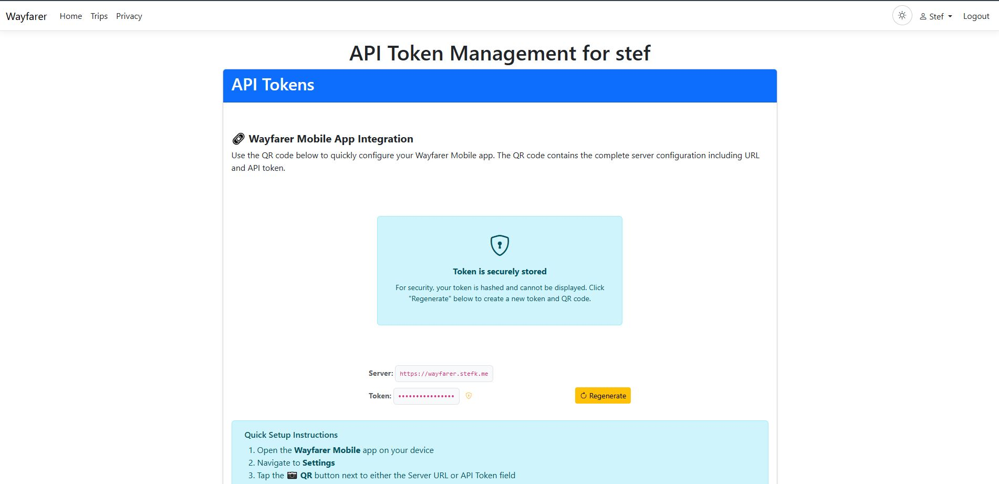
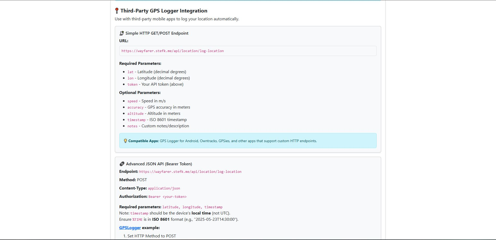
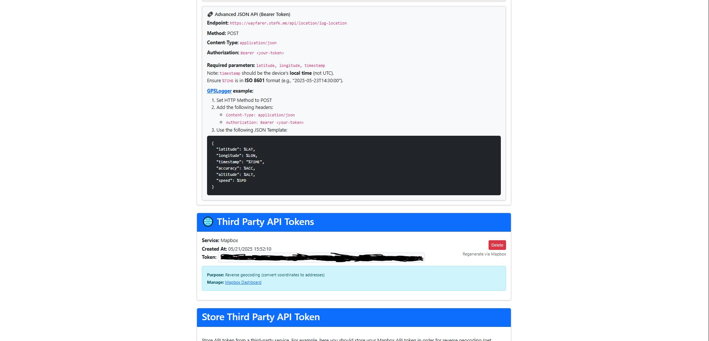

# API & Mobile Integration

The Wayfarer API provides RESTful endpoints for mobile app integration and external access.

---

## Authentication

- **Bearer tokens** via per-user `ApiToken` entries.
- Include header: `Authorization: Bearer <token>`
- Public endpoints (public trips, public timeline) require no auth.
- Private resources require token ownership.

Manage your API tokens from **User Settings > API Tokens**:







---

## Base Controller

- `Areas/Api/Controllers/BaseApiController` provides common functionality:
  - Token extraction and user resolution
  - Role-based access control
  - Helpers to sanitize floats and coordinates

---

## Endpoints Reference

### General

| Method | Endpoint | Description |
|--------|----------|-------------|
| GET | `/api/settings` | Application settings (thresholds, limits) |
| GET | `/api/activity` | List of activity types |

### Icons

| Method | Endpoint | Description |
|--------|----------|-------------|
| GET | `/api/icons?layout=marker\|circle` | List available map icons |
| GET | `/api/icons/colors` | Available icon colors (backgrounds and glyphs) |
| GET | `/api/icons/with-previews?layout=marker\|circle` | Icons with PNG preview URLs |

### Tags

| Method | Endpoint | Description |
|--------|----------|-------------|
| GET | `/api/tags/suggest?q={query}&take={count}` | Tag autocomplete suggestions |
| GET | `/api/tags/popular?take={count}` | Popular tags list |

### Users

| Method | Endpoint | Description |
|--------|----------|-------------|
| GET | `/api/users/{id}/basic` | Basic user info (Manager/User role required) |
| GET | `/api/users/stats` | User location statistics |
| GET | `/api/users/stats/detailed` | Detailed stats with country/region/city arrays |
| GET | `/api/users/activity?sinceHours={hours}` | Recent user activity (invites, memberships) |
| GET | `/api/users/search?query={query}&groupId={groupId}` | Search users for invitations |
| DELETE | `/api/users/{userId}/locations` | Delete all user locations |

### Trips

| Method | Endpoint | Description |
|--------|----------|-------------|
| GET | `/api/trips` | List trips for authenticated user |
| GET | `/api/trips/{id}` | Full trip structure (public or owner) |
| GET | `/api/trips/{id}/boundary` | Bounding box for tile prefetch |

### Trip Areas

| Method | Endpoint | Description |
|--------|----------|-------------|
| PUT | `/api/trips/areas/{areaId}` | Update area properties (name, notes, color, etc.) |

### Trip Tags

| Method | Endpoint | Description |
|--------|----------|-------------|
| GET | `/api/trips/{id}/tags` | Get trip tags |
| POST | `/api/trips/{id}/tags` | Add tag to trip |
| DELETE | `/api/trips/{id}/tags/{tag}` | Remove tag from trip |

### Locations

| Method | Endpoint | Description |
|--------|----------|-------------|
| POST | `/api/location/log-location` | Background GPS logging (filters: time, distance, accuracy, duplicates) |
| POST | `/api/location/check-in` | Manual check-in (rate-limited, bypasses time/distance thresholds) |
| GET | `/api/location/stats` | User location statistics |
| GET | `/api/location/search` | Search locations with filters (date, activity, address, country, region, city) |
| POST | `/api/location/get-user-locations` | Get user locations filtered by zoom and bounds |
| PUT | `/api/location/{id}` | Update location (coordinates, notes, activity, timestamp) |
| DELETE | `/api/location/{id}` | Delete single location |
| POST | `/api/location/bulk-delete` | Bulk delete locations |
| GET | `/api/location/chronological` | Chronological location data by day/month/year |
| GET | `/api/location/chronological-stats` | Statistics for date ranges |
| GET | `/api/location/has-data-for-date` | Check if user has data for a specific date |
| GET | `/api/location/check-navigation-availability` | Navigation availability for timeline UI |

#### Idempotency

- Optional header: `Idempotency-Key: <guid>`
- Applies to `/api/location/log-location` and `/api/location/check-in`.
- Repeat the same key to safely retry a request; the server returns the original success response.
- Keys are shared across both endpoints per user.

#### Third-Party GPS Logger Integration

For apps like GPSLogger, OwnTracks, or custom scripts, use the simple HTTP endpoint:

**Simple GET/POST:**
```
GET/POST /api/location/log-location?lat=37.123&lon=-122.456&token=YOUR_TOKEN
```

**Required parameters:**
- `lat` — latitude (decimal degrees)
- `lon` — longitude (decimal degrees)
- `token` — your API token

**Optional parameters:**
- `speed` — speed in m/s
- `accuracy` — GPS accuracy in meters
- `altitude` — altitude in meters
- `timestamp` — ISO 8601 timestamp (defaults to server time)
- `notes` — text notes

**GPSLogger configuration:**
- URL: `https://your-server/api/location/log-location`
- Method: POST
- Body: `lat=%LAT&lon=%LON&speed=%SPD&accuracy=%ACC&altitude=%ALT&token=YOUR_TOKEN`

### Visits

| Method | Endpoint | Description |
|--------|----------|-------------|
| GET | `/api/visit/search` | Search visits with filters (date, trip, status, place, region) |
| GET | `/api/visit/trips` | List trips with visits (for filter dropdown) |
| GET | `/api/visit/{visitId}/locations` | Get locations relevant to a specific visit |
| POST | `/api/visit/location-counts` | Get location counts for multiple visits |
| POST | `/api/visit/bulk-delete` | Bulk delete visits |

### Visit Backfill

| Method | Endpoint | Description |
|--------|----------|-------------|
| GET | `/api/backfill/info/{tripId}` | Backfill analysis metadata |
| GET | `/api/backfill/preview/{tripId}` | Preview backfill analysis |
| POST | `/api/backfill/apply/{tripId}` | Apply backfill changes |
| DELETE | `/api/backfill/clear/{tripId}` | Clear all visits for a trip |
| GET | `/api/backfill/candidate-locations` | Get location pings for visit candidates |

### Groups

| Method | Endpoint | Description |
|--------|----------|-------------|
| GET | `/api/groups` | User's groups |
| GET | `/api/groups/{id}` | Group details |
| GET | `/api/groups/{id}/members` | Group members |

### Invitations

| Method | Endpoint | Description |
|--------|----------|-------------|
| GET | `/api/invitations` | Pending invitations for user |
| POST | `/api/invitations/{id}/accept` | Accept invitation |
| POST | `/api/invitations/{id}/decline` | Decline invitation |

### Mobile-Specific

| Method | Endpoint | Description |
|--------|----------|-------------|
| GET | `/api/mobile/groups/{groupId}/members` | Group members |
| POST | `/api/mobile/groups/{groupId}/locations/latest` | Latest location per member |
| POST | `/api/mobile/groups/{groupId}/locations/query` | Spatial/time filtered query |
| GET | `/api/mobile/visits/recent?since=30` | Recent visits for polling (see below) |

---

## SSE (Server-Sent Events)

Real-time streaming endpoints for live updates.

### Web App SSE Endpoints

| Endpoint | Description |
|----------|-------------|
| `/api/sse/stream/location-update/{userName}` | User location updates |
| `/api/sse/stream/group-location-update/{groupId}` | Group location updates |
| `/api/sse/stream/visits` | Visit start/end notifications |
| `/api/sse/stream/invitations` | Invitation notifications |
| `/api/sse/stream/memberships` | Group membership changes |
| `/api/sse/stream/job-status` | Background job status updates |
| `/api/sse/stream/import-progress` | Import progress updates |

### Mobile SSE Endpoints

Mobile endpoints use Bearer token authentication:

| Endpoint | Description |
|----------|-------------|
| `/api/mobile/sse/visits` | Visit notifications for authenticated user |
| `/api/mobile/sse/group/{groupId}` | Consolidated group events (locations + membership) |

### SSE Event Types

```json
// Location update
{ "type": "location", "userId": "...", "latitude": 37.97, "longitude": 23.72 }

// Visit started (broadcast when user arrives at a planned trip place)
{
  "type": "visit_started",
  "visitId": "guid",
  "tripId": "guid",
  "tripName": "NYC Trip",
  "placeId": "guid",
  "placeName": "Coffee Shop",
  "regionName": "Manhattan",
  "arrivedAtUtc": "2025-01-15T10:30:00Z",
  "latitude": 40.7128,
  "longitude": -74.0060,
  "iconName": "coffee",
  "markerColor": "#8B4513"
}

// Job status
{ "type": "job_status", "jobName": "...", "status": "Completed" }
```

---

## Visit Notifications

The mobile app receives notifications when users arrive at planned trip places.

### Real-Time (SSE)

When the app is in the foreground, subscribe to SSE for instant notifications:

```
GET /api/mobile/sse/visits
Authorization: Bearer <token>
Accept: text/event-stream
```

### Background Polling (Fallback)

iOS and Android kill SSE connections when apps are backgrounded. Use API polling as a fallback after each location log:

```
GET /api/mobile/visits/recent?since=30
Authorization: Bearer <token>
```

**Parameters:**

| Parameter | Default | Max | Description |
|-----------|---------|-----|-------------|
| `since` | 30 | 300 | Seconds to look back for newly confirmed visits |

**Response:**

```json
{
  "success": true,
  "visits": [
    {
      "type": "visit_started",
      "visitId": "guid",
      "tripId": "guid",
      "tripName": "NYC Trip",
      "placeId": "guid",
      "placeName": "Coffee Shop",
      "regionName": "Manhattan",
      "arrivedAtUtc": "2025-01-15T10:30:00Z",
      "latitude": 40.7128,
      "longitude": -74.0060,
      "iconName": "coffee",
      "markerColor": "#8B4513"
    }
  ]
}
```

### Recommended Mobile Pattern

```
1. POST /api/location/log-location  → Log GPS position
2. If backgrounded (SSE unavailable):
   GET /api/mobile/visits/recent?since=30  → Poll for new visits
3. Display local notification for any new visits
```

This ensures visit notifications work reliably regardless of app state.

---

## Mobile App Integration

### Overview

- Mobile app: .NET MAUI project (`WayfarerMobile`) with Refit-based API clients, offline tile caching, optional background tracking, and SSE subscriptions for live updates.
- Server-agnostic: users configure their own server URL and API token; no hardcoded domains.

### HTTP Clients

- Base URL comes from `SettingsStore.GetApiBaseUrl()` which appends `/api` to the configured `ServerUrl`.
- Refit interfaces:
  - `IWayfarerApiService` (base `/api/`):
    - `GET /settings` — fetch server thresholds (time/distance/accuracy) for logging guidance.
    - `GET /activity` — list activity types.
    - `POST /location/log-location` — log background location with filtering (time, distance, accuracy, duplicates).
    - `POST /location/check-in` — manual check-in with rate limits (bypasses time/distance thresholds).
  - Send `Idempotency-Key: <guid>` for `log-location` and `check-in` to dedupe retries. Reuse the key only for retries of the same queued location.
  - `ITripContentApiService` (explicit `/api/trips/...`):
    - `GET /api/trips` — current user trips.
    - `GET /api/trips/{tripId}` — full trip content (public or owner).
    - `GET /api/trips/{tripId}/boundary` — bounding box for tile prefetch.
    - `POST /api/trips/{tripId}/tiles` — server-side tile list generation (if used by UI flows).

### Mobile-Specific API (Groups & SSE)

- Group endpoints (Bearer token), used by `GroupLocationsService`:
  - `GET /api/mobile/groups/{groupId}/members` — group members.
  - `POST /api/mobile/groups/{groupId}/locations/latest` — latest points per member.
  - `POST /api/mobile/groups/{groupId}/locations/query` — bounding-box/time filtered query with pagination.
- SSE client (`SseLocationClient`):
  - `GET /api/mobile/sse/visits` — visit notifications for authenticated user.
  - `GET /api/mobile/sse/group/{groupId}` — consolidated group events (locations + membership).
  - Adds `Authorization: Bearer <token>` and `Accept: text/event-stream`.
  - Auto-reconnect with backoff (1s, 2s, 5s), heartbeat comments handled.

### Auth & Configuration

- Token: per-user API token from the web app; stored in `SettingsStore.ApiToken`.
- Server URL: `SettingsStore.ServerUrl` (must be set by user). `ApiServiceManager` rebuilds clients on changes.
- QR Scanner: `QrScannerService` can parse a QR containing server config to populate URL and token.
- SSL (development): `WayfarerHttpService` conditionally bypasses SSL validation for localhost/private networks in DEBUG.

### Tracking & Permissions

- `TrackingCoordinator` manages GPS permission prompts and background capability; platform-specific trackers implement `IBackgroundTracker`.
- Tracking is independent of GPS activation: GPS may run while timeline logging is disabled (user toggle).
- Manual check-in uses `/api/location/check-in` with rate limiting (10s min interval, 60/hour) and returns standard responses.

### Offline Tiles & Caching

- Services: `LiveTileCacheService`, `TripTileCacheService`, `UnifiedTileCacheService`, with progress and notifications.
- Storage paths under `FileSystem.AppDataDirectory` (e.g., `tiles/trips`). Uses SQLite (`wayfarer.db`) to track downloads.
- Throttling: `TileRateLimiter`, `SettingsStore.MaxConcurrentTileDownloads` and `MinTileRequestDelayMs`.
- Tile server URL configurable via `SettingsStore.TileServerUrl` (defaults to OSM standard tile server). Respect provider usage policies.
- Server cache behaviour: the backend caches tiles for zoom levels 0-8 permanently and applies an LRU eviction policy for higher zooms. The default `CacheSettings:MaxCacheSizeMb` is 1024 MB but can be reduced for constrained hosts.
- Trip downloads coordinate with `TripContentService` which stores Trip/Region/Place/Area/Segment metadata locally.

### Trip Content & Navigation

- `TripContentService` pulls `TripDto` and stores structured content; progress events include counts for places/areas/segments.
- Navigation stack: `NavigationGraphBuilder`, `RouteCalculationService`, `TripNavigationService`, optional `NavigationAudioService`.

### DTOs & Conventions

- JSON: camelCase, UTC timestamps. Geometry SRID normalized to 4326 by backend.
- Selected DTOs (mobile side): `TripDto`, `BoundingBoxDto`, `TripTileRequestDto`, `TripTileListDto`, `TimelineLocationDto`, `GroupLocationsQueryRequest/Response`.

### User Settings Surface (selected)

- `ServerUrl`, `ApiToken`, `TrackingEnabled`.
- Tile cache: `MaxLiveCacheMB`, `MaxTripCacheMB`, `LiveCachePrefetchRadius`, `PrefetchDistanceThresholdMeters`.
- Navigation: audio on/off, language, volume, distance units, auto-reroute.

### Build & Platform Notes

- MAUI app configured via `MauiProgram.cs` (SkiaSharp, ZXing, Syncfusion).
- Android handler tweaks for Material button background tinting.
- Handlers: custom WebView handler permits external content where needed.

---

## Conventions

- JSON with **camelCase** property names
- Timestamps in **UTC** (ISO 8601)
- Geometry uses **SRID 4326** (WGS84)
- Numeric `NaN`/`Infinity` values dropped from responses
- Nullable fields omitted when null

---

## Error Handling

| Status | Meaning |
|--------|---------|
| 400 | Invalid request payload |
| 401 | Missing or invalid token |
| 403 | Insufficient permissions |
| 404 | Resource not found |
| 429 | Rate limit exceeded |

---

## Rate Limiting

- Check-in endpoint: limited to prevent spam
- Threshold enforcement based on application settings
- Rate limit headers included in responses

---

## Client Best Practices

- Avoid hardcoding server domains; treat server URL as user setting.
- Handle SSE reconnection gracefully.
- Respect rate limits and thresholds.
- Cache trip data when appropriate.
- Do not ship real tokens in code or screenshots. Provide QR onboarding for operator-specific servers.
- Respect tile server terms; consider self-hosted tiles for heavy usage.
- Keep SSE subscriptions scoped and stop on background when not needed to conserve battery.

