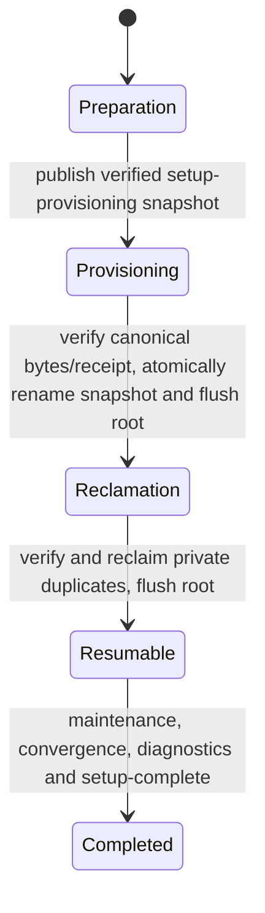
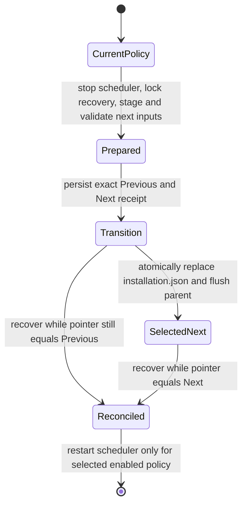

# Container and release contract

This page defines the supported container identity, trust and compatibility contract.
Maintainer sequencing belongs to [Versioning and Release Operations](23-Versioning.md);
publication procedures and evidence belong to
[application publication](27-Application-Image-Publication.md) and
[DB publication](28-Production-Compose.md#derived-db-publication-and-recovery).

## Support boundary

The supported bundle targets Linux Docker Engine with Compose v2, `linux/amd64` or `linux/arm64`, one
host, one Wayfarer instance and one bundled database. Use a supported Docker host
with local filesystems supporting Unix ownership, atomic rename and durable writes.
The host need not be Ubuntu; Ubuntu 24.04 is the application image OS. WSL is a
development environment, not separate production qualification. 32-bit ARM, Docker Desktop,
Swarm, Kubernetes, HA and shared/network database volumes are outside support.
No host .NET, Node, Python, PostgreSQL, Nginx or Certbot is required by the bundle.
Native/manual deployment remains available through [Deployment](20-Deployment.md).

The first supported Compose lifecycle/update baseline is v1.9.21. v1.9.20 remains
an immutable transitional publication. This application support floor is independent
of operator protocol and historical recovery compatibility; see the
[support decision and historical metadata boundary](23-Versioning.md#public-acceptance-and-availability).
Native/systemd v1.9.19 follows the
[#604 migration plan](https://github.com/stef-k/Wayfarer/issues/604) rather than Compose update.

Raspberry Pi 5 with 64-bit Ubuntu Server is an example generic ARM64 host.
The operator, host, local daemon and bundle must agree on platform; cross-architecture
setup/update/restore fail closed. Native/systemd ARM browser sandbox prerequisites
still require [separate qualification](https://github.com/stef-k/Wayfarer/issues/681).
Native ARM64 qualification uses `ubuntu-24.04-arm` CI, with one canonical external-mode setup/doctor/stop
and recovery-helper journey; QEMU-only evidence cannot qualify this contract.

## Application image

Use `mcr.microsoft.com/dotnet/aspnet:10.0-noble` (Ubuntu 24.04, glibc, full runtime)
and `mcr.microsoft.com/dotnet/sdk:10.0-noble` for the build stage. Each release must
resolve supported patched versions and pin base digests; floating tags below identify
families, not reproducible deployment inputs. Refresh patches through a tested new
release, never by rebuilding an already published release identity. Reassess the
family before upstream .NET/OS support ends. Do not use Alpine, chiseled/distroless,
or the Playwright test image as the final application base.

Publish framework-dependent Release `linux-x64` for AMD64 or `linux-arm64` for ARM64, without trimming, AOT or single-file
packing. Build Node 24/npm and MvcFrontendKit assets before publish; retain generated
CSS, `wwwroot/dist`, Trip Editor manifest/assets, compiled Razor, docs,
`frontend.config.yaml`, EF migrations and embedded `Scripts/tables_postgres.sql`.
The final image has ASP.NET, published payload and browser dependencies, no SDK,
npm, general-purpose Node installation or PowerShell. Playwright's own bundled Node
driver **is a runtime dependency** and must remain in the published `.playwright`
payload. Build-time browser installation tooling must not remove that driver.

Use the .NET image's `app` identity, UID/GID 1654, explicitly selected for runtime.
`/app` and `/opt/wayfarer-browsers` are root-owned, readable/executable by app, never
application-writable or overlaid by state mounts. Work directory/content root is
`/app`; Kestrel listens on internal HTTP port 8080. All writable paths are explicit.

Provision Chromium at image build time using the **published release's** Playwright
installer and its `install-deps chromium` package set on Noble. Copy/install browser
binaries under `/opt/wayfarer-browsers`; set `PLAYWRIGHT_BROWSERS_PATH` to that path.
Microsoft.Playwright 1.63.0 requires Chromium/headless-shell revision 1243
(153.0.8010.12), including the Chrome-for-Testing Linux ARM64 build; derive future revisions from its shipped `browsers.json`, not this
snapshot. Include fonts and Linux libraries, particularly `libasound2t64` providing
`libasound.so.2`. No runtime download, system-Chromium fallback or browser cache volume.

## Filesystem and volume authority

These are container targets; logical names are Compose volume keys, project scoped.

| Location | Default backing and owner | Classification |
| --- | --- | --- |
| `/app`, `/opt/wayfarer-browsers` | Immutable image, root | Release payload |
| `/var/lib/wayfarer` | `app-data`, 1654:1654 | Durable uploads/imports and complete key ring |
| `/var/cache/wayfarer` | `app-cache`, 1654:1654 | Rebuildable tiles, images, thumbnails |
| `/var/log/wayfarer` | `app-logs`, 1654:1654 | Operational logs, bounded retention |
| `/tmp/wayfarer` | Disposable tmpfs, 1654:1654 | Browser/application temporary work |
| `/var/lib/postgresql` | `db-data`, upstream postgres identity | Authoritative PostgreSQL 18 cluster; upstream PGDATA is `/var/lib/postgresql/18/docker` |
| Caddy `/data`, `/config` | `caddy-data`, `caddy-config`, image-appropriate owner | TLS/account state and generated proxy state |
| `/run/secrets` | Selected read-only protected file mounts | Secrets, never image content |

Set `Storage__DataRoot`, `Storage__CacheRoot`, `Storage__LogRoot`,
`Storage__TempRoot` to the four roots above; also set `TMPDIR=/tmp/wayfarer` for
Playwright-owned profiles. Existing derived paths remain `uploads/imports`,
`data-protection`, `tiles`, `images`, `thumbnails/trips`. Complete Data Protection
ring + matching DB + durable uploads form the recovery boundary; `app-cache` being
persistent does not make it authoritative. Cache reuse must preserve the existing
filesystem/DB metadata reconciliation contract; the recovery engine owns archive operations.

The application name remains exactly `Wayfarer`; fresh bundles explicitly select
`DataProtection__KeyRingPath=/var/lib/wayfarer/data-protection`. Never copy one key
and call that the ring. Preserve F1 preparation/F2 stable ciphertext requirements in
[provider migration guidance](24-Personal-Location-Providers.md#f1-preparation-to-f2-activation).
Old native `Uploads`, `TileCache`, `ImageCache` are bounded **writable** migration
inputs, not default container `/app` volumes. Neither startup nor image replacement
converts their absolute DB references or deletes them; native migration requires
the separate migration plan linked above.

Setup prepares named volumes with bounded one-shot ownership initialization before
running app as non-root. Never recursively chown arbitrary administrator paths.
Data/key directories must exclude other users (0700; key files 0600); logs/cache
may use 0750. Mount overrides require explicit absolute paths, ownership preflight
and preservation semantics; default durable/cache/log state uses named volumes.
Only config, secrets and an explicitly chosen backup destination use bounded bind
mounts. Backups live outside the live data volumes; mount them only into the later
backup operation, not the ordinary web service. No NAS mounting/credentials framework.

## Database contract

Select a narrowly scoped Wayfarer-owned DB image assembled from the official
`postgres:18.6-bookworm` multi-platform index with exact AMD64/ARM64 manifests and signed PGDG PostGIS **3.6.4**
packages. PostgreSQL **18.6 only** (`18.6-1.pgdg12+2`), PostGIS **3.6.4**
(`3.6.4+dfsg-2.pgdg12+1`) and Debian/glibc define the Compose baseline. Compose mounts
`/var/lib/postgresql`; upstream owns `PGDATA=/var/lib/postgresql/18/docker`.
There is no supported PG17 Compose baseline or PG17→PG18 migration path. The
[DB recipe and qualification](28-Production-Compose.md#exact-third-party-image-decision)
own the exact base/package pins and glibc compatibility checks.
The recipe uses the PostgreSQL project's signed package distribution; Wayfarer owns image assembly, qualification and publication,
not a fork of PostgreSQL/PostGIS. Prefer a maintained official-project artifact
when it can satisfy this contract again.

Each deployable bundle must name the published derived DB image by immutable
digest, never its base digest or a mutable build tag. The source bundle requires
`DB_DIGEST`; it cannot launch until publication supplies that value. Fresh clusters
use UTF8/C.UTF-8 with glibc case folding and byte ordering. Matching libc alone does
not make native data directories, locale/index versions or extensions portable;
logical native migration requires the separate migration plan. Backup tools run in the
selected version-matched DB image. Recheck live patch/support status and qualify
before every new bundle release. Wayfarer maintainers must rebuild and publish a
new immutable image for upstream security updates; containers never self-update.

Require `postgis` and `citext` in the application DB, checked by the explicit
maintenance operation. PostGIS initialization supplies spatial extensions; citext
is supplied by PostgreSQL and must be enabled explicitly. Do not grant the web
role superuser: setup uses a separate protected administrative credential for DB/
extension provisioning and grants the application/migration role required schema
rights. Readiness uses bundled `pg_isready`; this only proves connection acceptance,
not credentials, extension availability, schema compatibility or application health.

No host DB port is published. Never mount this PG18 directory into another major.
Ordinary Wayfarer updates keep the DB major fixed; PostgreSQL major upgrades need a
separate explicit backup/restore or pg_upgrade contract and qualification. PostGIS
extension upgrades likewise require an explicit tested step, not tag drift.
External PostgreSQL remains possible for native/manual installations; a managed
external-DB mode is deferred and must prove the same extensions, permissions,
version/backup compatibility and readiness before claiming support.

## Release and bundle identity

Registry authority is `ghcr.io/stef-k/wayfarer`. Stable tags are `vX.Y.Z`, matching
the Git tag/GitHub Release and compiled `Version.props` version `X.Y.Z`. Record the
full source SHA independently: informational version deliberately omits it. Never
retarget a stable tag or overwrite its bundle; patched dependencies require a new
release. No `latest` alias is published. If aliases are added, they are
convenience pointers only and never update/restore authority. Prerelease SemVer tags
and `dev-<full-sha>` images are opt-in, unsupported for ordinary stable lifecycle;
neither can replace a stable version identity.

Every stable release binds:

- human release version/tag and full source SHA;
- compiled app version and OCI source/revision/version labels;
- immutable Wayfarer index digest and the selected `linux/amd64` or `linux/arm64` platform (record index and
  selected platform digest separately if an index is published);
- exact PostgreSQL/PostGIS and Caddy image digests;
- bundle checksum, bundle contract version and configuration schema version;
- required CLI version, expected terminal EF migration and explicit supported
  source release/schema boundaries for update/restore.

Do not infer restore compatibility from SemVer or image availability alone. Unknown
bundle/schema/architecture combinations fail closed. Restore uses the recorded
matching image first; any subsequent upgrade is a separate managed operation.
A digest proves identity, not publisher trust: obtain metadata from the project's
release channel and verify checksums against that trusted release metadata.

For each supported architecture, publish the primary `wayfarerctl-linux-<arch>.tar.gz`
bootstrap and its `.tar.gz.sha256` sidecar together with the secondary
`wayfarer-vX.Y.Z-linux-<arch>.tar.gz` deployment archive and its `.tar.gz.sha256`
sidecar on the exact stable GitHub Release (`<arch>` is `amd64` or `arm64`).
The bootstrap contains exactly `wayfarerctl`, copied from the canonical bundle's
operator bytes with identical SHA-256, never a second build or implementation.
The checksum sidecar provides human/offline integrity evidence, not publisher
authentication. Automatic acquisition uses the GitHub Release Asset REST `digest`
field as transport-integrity authority. The inspectable bundle contains `compose.yaml`,
non-secret configuration template/schema, Caddy template, `release.json`, operator docs, the
self-contained native `wayfarerctl` executable and minimal install/bootstrap glue.
Start `bundleContractVersion` and `configurationSchemaVersion` at 1. `release.json`
owns the fields above and the CLI compatibility requirement. Exact JSON serialization
is owned by the release tooling; consumers must reject unsupported contract
versions, not silently improvise. No source clone or host .NET/Python is needed.

The ordinary installation is verified bootstrap extraction followed by
`sudo ./wayfarerctl setup`. Bare setup acquires latest stable through the shared
public acquisition owner; `setup --version X.Y.Z` uses the same exact-version
resolver. The secondary `setup --bundle /absolute/trusted/bundle` skips network
discovery/download and requires exact local images. These selectors are mutually
exclusive. Both routes derive immutable application/DB/Caddy identity from validated
`release.json`, retain one canonical bundle and enter the existing setup engine.
No administrator-supplied stable digest or second installer is permitted. Bootstrap
bytes never self-update; retained-release dispatch owns subsequent lifecycle work.
See [Install & Self-Hosting](02-Install-and-Dependencies.md) and
[operator guidance](29-Wayfarerctl.md).

GHCR packages must be explicitly public and verified by anonymous digest pull from
a clean client. A public repository alone is insufficient. Publishing uses scoped
Actions `GITHUB_TOKEN` with `packages: write`, linked to the source repository;
ordinary operators need no registry credential. Private testing may use appropriate
read access, but cannot qualify public installation. The application/bundle publication
pipeline and real public-installation gate are documented in
[image publication](27-Application-Image-Publication.md).

## Configuration, secrets and project identity

Default administrator-owned install root: `/etc/wayfarer`, configurable once during
setup. Store immutable extracted bundles in `releases/vX.Y.Z/`, non-secret deployment
inputs in `deployment.env`, secrets in `secrets/`, generated installation identity
in `installation.json`. `wayfarerctl` locates that root explicitly or by the default,
then invokes Compose with absolute bundle/config paths and explicit `--project-name`.
Do not derive identity from the caller's current directory. Default project name is
`wayfarer`; a setup-time alternative must match `[a-z0-9][a-z0-9_-]*` and be persisted.
Do not rename a project during updates, which would silently select fresh volumes.

Stable service keys: `wayfarer`, `db`, `caddy`. Maintenance uses one-shot commands on
the `wayfarer` service/image, not a second independently versioned migration image.
Use Compose service/project labels and APIs/commands; generated container names and
`container_name` are not public interfaces. Stable networks are `backend` (internal,
DB + app) and `edge` (app + managed Caddy, outbound access). App needs egress for
providers/tiles; do not isolate all its networks. Caddy has no DB network access.

`deployment.env` contains generated hostname, image digests, native platform when
specified, proxy/network/loopback inputs and protected secret-file paths, never
passwords. Installation UUID and backup policy belong to `installation.json`, not
the interpolation file. Container settings
include Production environment, internal HTTP binding, explicit Storage/browser
paths, AllowedHosts and narrowly scoped trusted proxy configuration. Managed mode
only publishes Caddy 80/443. External mode omits Caddy and must use an explicitly
bounded loopback/private application binding and trusted proxy authority; detailed
forwarded-header/security behavior is defined by
[application configuration](26-Application-Container.md#configuration-and-health).

Secrets are protected generated files, directory 0700 and files 0600, mounted
read-only only into consumers under `/run/secrets`. DB uses `POSTGRES_PASSWORD_FILE`;
Wayfarer uses its [explicit file-based connection-secret reader](26-Application-Container.md#configuration-and-health)
(ASP.NET configuration does **not** automatically support arbitrary `_FILE`
variables). Local Compose file secrets are bind mounts, not an encrypted secret
store: provision host ownership/readability for the actual container UID, and do not
assume Compose `uid`/`gid` remaps file ownership. Never put secrets in argv, image
layers, examples, deployment.env, interpolation output, logs or doctor diagnostics.
Administrator password bootstrap/reset uses protected input/stdin, never the existing
password-argv CLI. Preserve generated identity and receipts: bundle/runtime facts can
corroborate them but cannot independently select an installation UUID, active storage
generation or authorized lifecycle operation.

## Persisted Compose lifecycle authority

This is the canonical cross-lifecycle state contract. Detailed release, restore and
update procedures remain in their linked sections below.
[Lifecycle recovery limits](#lifecycle-recovery-limits) describe supported residue
reconciliation and cases requiring administrator intervention.

Authority classes distinguish **selected identity/policy**, **operation intent**,
**derived input/exclusion**, **preparation** and **historical completion/evidence**.
A validated identity selects resources; a receipt authorizes a bounded operation;
neither substitutes for present health or independently verified ownership.

### Installation JSON schema and evolution

[`installation.json`](../tools/WayfarerCtl/Deployment.cs) is generated non-secret JSON, root:root 0600, within a root:root
0700 installation root with safe, link-free ancestors. `Deployment.Load` bounds it
to 262144 bytes, rejects unknown JSON members, validates the native platform and
bundle, corroborates retained release authority, compares generated environment
bytes and checks the selected storage overlay. It does **not** alone establish
complete secrets, a setup receipt, lifecycle completion or Docker resource ownership.

Ordinary serialized commands (`backup configure`, `backup`, `backups`,
`verify-backup`, `user find/reset-password`, `start`, `stop`, `restart`) acquire
`operation.lock`, recheck unresolved restore/update intent, then load the current
deployment. For release-managed installations they also verify the running executable
against that selected retained release before command-specific mutation or recovery
reservation. Host exclusion precedes recovery exclusion. `status`, `doctor` and `logs`
may use a point-in-time snapshot without acquiring this host mutation lock.
Receipt-owned restore/update continuation retains its original operator owner.

The serialized property names are case-sensitive PascalCase. Omitted properties
use declared defaults before validation; this is a versioned reader contract, not a
requirement to hand-author JSON. Status/doctor never upgrade schemas.

| Schema | Installation UUID | Storage selection | Release and backup semantics |
| --- | --- | --- | --- |
| 1 | Empty/omitted only | Canonical volumes; no `StorageGeneration` | Historical setup identity; `Backup` and `Release` absent/null |
| 2 | Nonempty | Canonical volumes | Adds installation identity and optional backup policy; no `Release` |
| 3 | Nonempty | Required generated 32-character lowercase hex identity | Adds paired storage generation; optional backup; no `Release` |
| 4 | May be empty only while `Backup` is absent/null | Canonical or a generated identity | Requires `Release`; backup still requires nonempty UUID |

Current fresh setup creates schema 4 with retained release authority and explicit
native platform, but no UUID, backup policy or storage generation. First backup
configuration or restore assigns an absent UUID; backup preserves schema 4, restore
selects at least schema 3, and metadata-only release adoption selects schema 4 while
preserving an absent historical UUID. Older schemas remain readable with their
original semantics; old operators reject unsupported schemas/additive members.

| Property | Role, accepted values and defaults |
| --- | --- |
| `Schema` | Local installation schema, 1–4; default 1. Separate from release manifest, recovery source and receipt schemas |
| `Installation` | Local UUID, default empty/omitted; requirements above. Archive source UUID does not select the target |
| `Release` | Retained `ReleaseAuthority`: `Name`, `Fingerprint`, `OperatorVersion`, `OperatorSha256`. Names are `vX.Y.Z` or `candidate-vX.Y.Z-<40-lowercase-hex-source>` (at most 100 characters); both hashes are 64 lowercase hex characters; operator version is exact stable syntax. Selection revalidates complete retained bytes and owner identity |
| `StorageGeneration` | Null for canonical storage, otherwise 32 lowercase hex characters; generated locally, never taken from archive volume names |
| `Backup` | Null before opt-in; embedded policy is the sole configuration authority, with its own selected recovery generation |
| `Bundle` | Required fully qualified path, without newline/CR, `$`, quotes or backtick. Required trusted bundle files and safe paths must exist; default empty fails validation. Release corroboration checks consumed runtime bytes; current setup uses the retained directory |
| `Project` | Fixed resource namespace, `[a-z0-9][a-z0-9_-]{0,62}`; default `wayfarer` |
| `Hostname` | Public DNS hostname, at most 253 characters, labels 1–63 with no leading/trailing hyphen, dotted name and letter-bearing final label; rejects reserved local/test/example/onion/alt suffixes; default empty fails |
| `Mode` | `managed` (default) or `external`; topology choice, not observed proxy health |
| `AppDigest`, `DbDigest` | Exact `sha256:` plus 64 lowercase hex digits. App default empty fails. Omitted DB uses a historical serialization fallback; stable release metadata must corroborate the selected native DB manifest |
| `Platform` | `linux/amd64` or `linux/arm64`, matching native operator/host. Historical null/omission resolves AMD64; `RuntimePlatform` is computed and never serialized |
| `EdgePrefix` | Three IPv4 octets selecting a private `172.16–31.x.0/24`; default `172.30.64`. Collision admission remains preflight's responsibility |
| `LoopbackPort` | 1–65535, default 8080. The generated external binding is `127.0.0.1`; proxy hop is the selected edge gateway `.1` |

Backup policy is installation-owned, including `Enabled` (default true), canonical
literal `Destination`/`Payload` paths, `Kind` (`local` default or `mounted`), payload
checksum `PayloadSha256` and selected `Generation` (both 64 lowercase hex), and
destination `DeviceMajor`/`DeviceMinor`/`Inode`. Those observed identities bind the
dedicated destination; path existence alone cannot substitute for them. Defaults
and bounds are `Retention` 7 (1–100), `DailyMinute` 180 (0–1439 UTC),
`JitterMinutes` 15 (0–15), `Attempts` 3 (1–3), `DeadlineSeconds` 600 (30–3600).
`Source` is the validated versioned recovery `SourceIdentity`; `Uploads` and `Ring`
are safe relative product-root names. Payload, image, bundle, project, source and
generated-worker identities are checked before use. See
[recovery policy and source compatibility](29-Wayfarerctl.md#compose-recovery-sets).

### Companion validation and completion

For a **loadable deployment**, `Deployment.Load` requires the protected identity,
bundle, exact generated environment and selected overlay/release where applicable.
It selects `deployment-generations/<Release.Fingerprint>/deployment.env` when that
file exists, otherwise root `deployment.env`; either must exactly equal the render
from the identity and installation root. The root file remains historical after
update selects generated inputs. Neither file is an independent configuration owner.

A **canonical resumable setup** additionally requires complete protected `secrets/`
and `SetupProgress.Load` verification. The three 0600 files are `db-password`
(root:root), `db-app-password` (999:999), and `app-password` (1654:1654), under the
root:root 0700 parent. Each contains exactly 64 uppercase hex characters; the two
application copies match and differ from the administrative DB password. Secrets
are authoritative credential bytes and are never regenerated by setup resume.

`setup-progress.json` schema 1 binds ordered per-file SHA-256 hashes of the original
identity, root environment, all three credentials and the five consumed bundle
inputs. `Completed` is 0–3: none, migration, seed, bootstrap. `AdminStarted` can be
true only after seed, and must be true when bootstrap is recorded complete. Its
fingerprint is private evidence, not permission to infer credentials or recreate
inputs. After backup configuration, release adoption, restore or update changes
installation bytes, this original setup receipt is historical; do not rebind it or
use setup resume as a later lifecycle repair.

**Ordinary lifecycle eligibility** also requires validated secrets, required Docker
preflight/resource checks, completion evidence and no unresolved restore/update,
backup transition or delegated reservation at the operation's mutation boundary.
Locks serialize operations. Status/doctor and logs have their narrower diagnostic
admission; their availability is not mutation authorization.

`InstallationCompletion.IsComplete` rejects unresolved restore/update then checks
historical completion: existence of `setup-complete`, or a protected `restore-complete`
containing a nonempty D-format operation UUID (at most 64 bytes). Setup writes `1\n`
after diagnostics; its reader currently uses file existence, without validating
contents. Restore writes its marker before final Accepted. Neither marker proves
current health, a matching setup fingerprint or present service ownership. Backup
policy loading requires historical completion even during unresolved restore, while
ordinary mutation still requires resolved intent. Accepted receipts alone cannot
replace completion evidence; `restore-complete` records the most recent restore
finalization's operation and can precede Accepted, without selecting the current
receipt/history or storage by itself.

### Authority inventory

Paths below are relative to the selected installation root unless marked destination.
All recovery actions assume safe ownership and exact matching evidence. Unknown,
foreign or contradictory state requires administrator reconciliation, not deletion.

| State/artifact | Owner | Authority class | Created/committed when | Valid partial residue | Blocks what | Supported recovery | Never infer |
| --- | --- | --- | --- | --- | --- | --- | --- |
| `installation.json` | `Deployment`; setup/backup/adopt/restore/update writers | Selected identity/policy | Complete initial publication; later atomic pointer replacement | Partial canonical files only with verified provisioning or new-restore intent | Invalid/mixed inputs block deployment loading | Owning setup/backup/restore/update command; otherwise reconcile trusted inputs | Existence means valid, resumable or complete |
| `deployment.env`; `deployment-generations/<fingerprint>/deployment.env` | `Deployment.EnvironmentFile`; `UpdateActivation` | Derived input | Prepared before selecting identity; exact bytes checked | Unselected generations and old root input retained | Missing/changed selected bytes block Compose | Owning receipt continuation; trusted-input reconciliation | An env file selects a release/policy independently |
| `secrets/` | `ProtectedFiles`; provisioning/new restore | Credential authority | Complete snapshot before setup publication; new restore after Authorized | Matching publication subset with complete snapshot; receipted new-restore subset | Missing/changed/unsafe bytes block continuation | `setup --resume` or `restore --resume UUID`, according to owner | File replacement rotates an existing DB password |
| `releases/<Name>/` | `ReleaseStore`; `ReleaseBundle` | Immutable retained release | Create-only rename after full validation | Identical retained bytes may precede setup | Occupied different/corrupt identity blocks import/use | Same acquisition/import revalidates; contradiction requires reconciliation | Directory presence is installation or image readiness |
| `releases/.acquire-*`, `.pull-*`, `.setup-*` | Acquisition/setup preparation | Preparation | Private download/client/initial-input staging | Interrupted stages may remain under `releases/` | Do not block plain setup solely by existing there | Repeat original plain setup; preserve residue | Staged secrets/downloads are canonical installation state |
| `releases/.stage-*` and sibling `.json` | `ReleaseStore.Import/Reconcile` | Placement intent; payload preparatory | Owner receipt before copy; create-only final publication | Incomplete copy, complete unpublished stage, or final plus leftover receipt | Invalid bytes cannot be adopted; another plain setup may import privately | Plain setup/import; `release reconcile .stage-ID` only for verified complete placement | Receipt proves staged bytes are complete; collision permits overwrite |
| `setup-provisioning/` | `SetupProvisioning` | Complete original-input recovery snapshot | Atomic directory rename and parent flush before canonical publication | Matching canonical subset or full canonical receipt before reclamation handoff | Plain setup; incomplete snapshot or mismatched published inputs block resume | `setup --resume` validates the complete snapshot before publication/handoff | Canonical progress alone permits ignoring a surviving snapshot |
| `setup-provisioning-reclaim/` | `SetupProvisioning` | Private duplicate reclamation, never publication authority | Create-only atomic rename from the complete snapshot after canonical byte/receipt validation, then root flush before deletion | Any subset of original duplicate files, including an empty directory | Plain setup; coexistence with authoritative snapshot, foreign/unsafe or changed residue blocks resume | `setup --resume` independently validates canonical deployment, secrets and initial receipt, then verifies/reclaims remaining duplicates | This directory can recreate missing canonical inputs |
| `setup-progress.json` | `SetupProgress`; setup executor | Setup intent/checkpoints | Initial receipt before Docker resources; file flush, atomic replacement and root flush before dependent mutation | Last committed checkpoint; lost result remains uncertain | Changed inputs or invalid progress block setup resume | Original setup resume; uncertain admin uses explicit `--retry-admin` after lookup | Progress 3 means diagnostics/completion passed |
| `setup-complete`; `restore-complete` | Setup diagnostics; `InstallationCompletion.RecordRestore` | Historical completion | Setup file and root flush after diagnostics before success; restore after postflight/restart restoration, before Accepted | Restore marker can coexist with unresolved WritesPossible; failed setup flush attempts to remove its marker | Absence blocks ordinary lifecycle/backup policy loading | Owning unfinished operation; failed setup flush with surviving marker requires reconciliation; completed installation uses doctor | Marker is current health or operation authorization |
| `operation.lock` | `Setup.Lock`; host lifecycle owners | Live kernel serialization | Open stable protected file; lock byte 0 | Inode remains after process exit/death | Concurrent host mutation while lock held | Retry after actual owner exits; preserve inode | File existence means operation still runs |
| `recovery-control/recovery.lock` | `RecoveryLock`; host/worker | Live kernel exclusion | Once-provisioned root:1654 0660 inode, 0755 root parent | Stable inode survives owner death | Concurrent capture/recovery mutation while held | Retry after owner exits; never replace/unlink inode | A stale pathname is a held lock |
| `recovery-control/host-operation.json` | `BackupCommands`; owning recovery continuation | Delegation/reservation intent | root:1654 0640, exact token/container and capture/hold facts before worker launch | Worker stopped/running/unknown after client loss | Independent workers and ordinary mutation | Standalone: `backup configure --recover` after confirming worker stopped; restore: owning resume; update: owning resume/pre-migration abort validates exact delegation and reconciles its helper before clearing under recovery exclusion | Lost client proves worker stopped; existence grants a skip-lock flag |
| `restore-in-progress`; `update-in-progress` under `recovery-control/` | Receipt save owners; worker validator; `backup configure --recover` | Derived persistent exclusion | Alongside unresolved receipt; removal after resolution | Terminal protected receipt with its exact stale UUID marker | Workers defer while marker exists without matching delegation | Owning unresolved operation; exact terminal residue uses `backup configure --recover` under host then recovery exclusion with completion/ownership checks | Marker is independent receipt authority or safely removable by hand |
| `backup-identity`; destination `.wayfarer-recovery` | `BackupConfiguration` | Prepared UUID; destination binding | First opt-in before installation pointer commit | UUID/control/destination preparation may precede policy commit | Foreign destination identity blocks configuration | Retry original configuration with trusted matching destination | Prepared UUID alone upgrades installation schema |
| `recovery-generations/<Backup.Generation>/` | `BackupGeneration`; `BackupCompose` | Derived worker/scheduler input | Immutable compose/worker files staged and checked before pointer commit | Old/unselected generations retained | Changed selected bytes/payload/source block worker use | Backup transition recovery or owning restore/update | Worker JSON is a second policy authority |
| `backup-transition.json`; `installation.backup-next` | `BackupGeneration` | Exact old/next configuration intent; staged pointer | Receipt flushed before staged pointer; installation rename is commit | Current bytes exactly Previous or Next; matching pending next | Ordinary mutation until recovery | `backup configure --recover`; retain current valid side | Recovery always rolls forward/back or adopts mixed bytes |
| `backup-previous.json` | `BackupGeneration.Recover` | Retained evidence | Previous bytes saved if file absent before clearing transition | Earlier saved evidence retained across later configurations | No independent mutation authority | Administrator diagnosis, validated against live transition if used | Always the latest previous policy or rollback authorization |
| `recovery-control/state/scheduler.json` | `RecoveryScheduler` | Operational slot/retry receipt | Flushed atomic replacement in private UID1654 state | Interrupted attempt or retention-failed committed slot | Replaying completed slot; corrupt receipt defers | Scheduler verifies exact committed slot under lock; administrator handles corrupt evidence | Scheduler receipt selects policy or proves archive integrity |
| Destination archive, `.sha256`, `.restore-hold` and private partials | `RecoveryEngine` | Complete-pair evidence; durable retention hold; preparation | Archive then sidecar last; hold before publication for delegated recovery | Owned partial/orphan members and pending holds | Holds exclude committed pair from retention; invalid pair not selectable | Engine reconciles owned residue under recovery lock; preserve held sets | Hold/sidecar alone authenticates custody or full pair |
| `restore-plans/<operation>/`; `update-plans/<operation>/` | Preparation owners | Frozen plan/evidence | Plan hash and verified local facts before acceptance | Unaccepted plans/extraction/inspection residue | Stale or changed evidence prevents execution | Accept exact plan or prepare another; preserve unresolved operation inputs | Planning authorizes destructive execution |
| `recovery-control/restore.json`, `restore-history/` | `RestoreReceipt`; restore executor | Protected restore intent/history | Authorization and contiguous phase commits; resolved history before next restore | Frozen input, candidate attempts, old/new pointer transaction | Unresolved receipt blocks ordinary mutation | `restore --resume UUID`; pre-writer abort where allowed | Candidate files/containers prove activation or acceptance |
| `installation.json.abort` | `RestoreActivation`; matching pre-writer restore receipt | Non-authoritative staged canonical old pointer | Protected old bytes before atomic replacement and root flush | Exact staged bytes may survive interruption before rename | Foreign/changed/unsafe or unowned residue blocks abort | Retry `restore --abort` with the same UUID; admit only exact root:root 0600 single-link regular bytes within the installation bound | Filename alone authorizes rollback or manual deletion |
| `recovery-control/update.json`, `update-history/` | `UpdateReceipt`; update executor | Protected forward intent/history | Exact accepted plan; migration cutoff before helper launch | Held archive, helper uncertainty, old/target pointer, joined restore | Unresolved receipt blocks ordinary mutation | Update resume/pre-migration abort; explicit `update --restore UUID` | Old image is rollback; joined restore is forward Accepted |
| `storage-generations/<generation>/compose.json`; logical volumes | `ActiveStorage`; restore activation | Derived mapping; selected durable data | Overlay prepared before installation pointer selects three roles | Unselected old/failed candidate generations retained | Selected overlay/mount contradiction blocks operation | Exact restore receipt continuation; retain old evidence | Largest/newest volume or directory is active |
| `update-plans/<operation>/completed` | `UpdateActivation` | Historical postflight evidence | After exposure/scheduler/restart restoration, before Accepted receipt | Marker may precede final acceptance | Does not resolve receipt independently | Resume exact update finalization | Marker alone authorizes ordinary mutation |

### Fresh setup boundaries

This is a logical publication model, not a test that one pathname exists. The full
canonical receipt can coexist with its authoritative snapshot before the atomic
reclamation handoff. The private reclamation name permits incomplete duplicate residue
only after canonical deployment, secrets and initial receipt independently validate.
Both snapshot names together are ambiguous and require reconciliation. No Docker
mutation occurs until canonical validation and private snapshot reclamation finish.

| State | Permitted persistent state | Plain setup | Setup resume | Supported action |
| --- | --- | --- | --- | --- |
| Preparation only | Root absent, empty, or top-level `releases/` and `operation.lock` only; private staging may contain generated inputs | Yes, after safety/preflight checks | No valid installation receipt yet | Retry the same setup/options after correcting the cause |
| Protected provisioning | Complete verified root snapshot; zero or more byte-identical canonical files, including partial `secrets/` | Refused | Publishes original bytes without replacement, then validates canonical receipt | `setup --resume` with original root |
| Private reclamation | Canonical original deployment, complete secrets and matching initial receipt; only safely owned, byte-identical duplicate members remain under the reclamation name | Refused | Validates canonical authority independently, flushes the observed handoff, then finishes duplicate cleanup | `setup --resume` with original root |
| Incomplete/unreceipted identity | Canonical identity/credentials without a valid snapshot or exact receipt, changed/unsafe files, unknown top-level residue | Refused | Refused | Preserve state; administrator reconciles original provenance/ownership |
| Committed resumable identity | Loadable original deployment, complete secrets, matching progress; no completion or unresolved restore/update | Refused | Valid after retained-resource preflight; committed mutations skipped | `setup --resume`; explicit admin retry only when lookup cannot confirm |
| Completed installation | Historical completion plus valid current deployment/credentials and resolved lifecycle intent | Refused | Refused as already complete | `doctor`, then supported ordinary lifecycle commands |

After migration has been recorded, resume requires the retained DB volume; missing
configuration never proves an empty database. Unrecorded migration/seed outcomes may
repeat through idempotent application maintenance. `AdminStarted` is saved before
bootstrap; uncertain success requires application-owned lookup before explicit retry.
Present service health is checked again during continuation and by doctor.

Initial snapshot publication and canonical files use file flushes, directory flushes
and create-only rename. Before destructive cleanup, the complete snapshot moves
atomically to the private reclamation name and the installation directory is flushed.
Resume also flushes an observed reclamation handoff before deleting any member.
Setup progress replacement flushes a protected temporary file, renames it atomically
and flushes the installation directory before the next dependent mutation. Completion
uses exclusive flushed file creation followed by the same parent flush before success.
A flush failure stops the operation and preserves its primary error; completion tries
to remove only its newly created marker, requiring reconciliation if that removal
also fails. Source and normal-process checks do not establish hardware power-loss qualification.

### Backup configuration commit and recovery

Preparation may create a UUID, control state, destination marker and immutable
generation without selecting the policy. Commit requires derived-input and destination
capability checks. `backup configure --recover` accepts only exact Previous/Next
installation bytes, retains previous evidence, validates/removes matching pending
next bytes, then removes the transition and flushes the directory. It keeps whichever side was
actually selected; it does not invent rollback or complete an uncommitted switch.
It also clears a standalone host reservation only after confirming its named worker
is not running. Unknown worker state remains blocking. Under the existing host then
recovery exclusion, it validates both stale terminal markers before removing either.
Each root-owned single-link marker must equal its protected receipt's exact operation
UUID. Accepted restore requires matching `restore-complete`; accepted update requires
its operation's `completed` plan hash. Aborted operations require previous installation
completion without contradictory acceptance/mutation evidence. A `RestoreAccepted`
update requires its exact accepted restore and existing two-receipt ownership join;
it never becomes forward-update Accepted. Missing, unresolved, malformed, unsafe,
foreign or contradictory evidence stays blocking and untouched. Cleanup removes only
the exact derived entries and fsyncs `recovery-control/`, preserving receipts/history
and completion-before-Accepted ordering. The outer backup command
starts the selected enabled scheduler; a successful pointer commit alone does not
mean the scheduler is healthy.

### Restore, update and generation commits

Restore's authoritative phases and recovery actions are specified in
[activation and recovery](29-Wayfarerctl.md#activation-recovery-and-retained-evidence).
Its phase diagram there includes the separate abort branch. `restore-plans` and
candidate volumes are preparation; the protected Authorized receipt grants new-root
provisioning or existing-install recovery. New-root restore has no setup receipt and
finishes with `restore-complete`. Existing restore preserves local credentials and
policy. `ActivationIntent` binds exact old/new configuration bytes before the single
installation-pointer commit selects the paired generation. `WritesPossible` is
saved before the canonical candidate application can start; failed acknowledgement
cannot authorize old-data rollback. Postflight, exposure, scheduler and restart-policy
restoration precede completion-marker publication and final Accepted. Update-owned
restore cannot abort into the migrated old generation.

At `ActivationIntent` or `ActivatedStopped`, a matching unresolved, non-update-owned
pre-writer abort republishes old authority only when the live pointer equals the
receipt's exact old or new bytes. Canonical old storage may consume an interrupted
`installation.json.abort` only when it contains the exact receipted old bytes and
meets the installation pointer's protection and 262144-byte bound. Earlier phases
and generated old storage reject this fixed residue; generated storage retains its
existing immutable-overlay commit. Retry also admits an already-published old
pointer after interruption before the Aborted receipt save. Old service recreation
must succeed before Aborted is saved; services remain stopped. Preserve foreign,
changed, linked or otherwise unsafe residue for explicit reconciliation.

The [forward update phase diagram](29-Wayfarerctl.md#trusted-local-managed-forward-update)
is canonical. `MigrationStarted` precedes maintenance helper launch and is an earlier
irreversible cutoff than normal application `WritesPossible`. Target deployment and
backup generations are prepared before atomic installation-pointer activation;
DB/app-data/cache and credentials stay selected as the same physical generation.
Final Accepted follows private postflight, exposure, scheduler, restored restart
policies and the operation's completed marker. Pre-migration abort leaves services
stopped. After migration, explicit recovery joins `RestoreOperation`/`FromUpdate`,
the held archive and retained old operator; accepted restore sets `RestoreAccepted`
and resolves the update without calling the failed forward operation Accepted.
Retained receipt owners select recovery executables even after active release changes.

The installation pointer selects `db-data`, `app-data` and rebuildable `app-cache`
together: `<Project>_<role>` for canonical storage, or
`<Project>_<role>_<StorageGeneration>` for generated storage. Logs and Caddy data/config
keep fixed names. Unselected storage, deployment and recovery generation files are
inert; their existence or timestamps do not activate them. Restore/update pointer
replacements and receipt writes flush their parent directories. Old/failed generations,
plans, releases, images and held recovery evidence remain retained.

### Lifecycle recovery limits

Persisted-state tests and controlled residue probes cover the recovery boundaries
below. Reconstructed residue and normal-process checks do not establish hardware
power-loss, reboot or production-host qualification.

| Boundary | Supported recovery and limit |
| --- | --- |
| Setup snapshot reclamation interrupted | An atomic authoritative-snapshot → private-reclamation handoff permits verified duplicate cleanup on resume. Partial authoritative snapshots from older deletion behavior still require reconciliation; they are never reclassified as private residue |
| Delegated capture interrupted during update | Update resume/pre-migration abort admits only the exact generated root:1654 0640 reservation and reconciles its helper. Unsafe/foreign authority and unknown Docker state remain blocking |
| Terminal receipt survives alongside a derived exclusion marker | `backup configure --recover` reconciles exact terminal markers only when protected receipts, completion evidence and any restore/update ownership join agree. Unresolved/foreign or contradictory state remains blocking |
| Setup progress or completion durability fails | Both writes flush the parent directory before dependent mutation/success. Failed completion preserves the primary error and requires reconciliation if its newly created marker cannot be removed |

## Lifecycle ownership

Maintenance stays in the application executable using existing EF/seeding authorities;
no SDK/EF tool installation, shell SQL migration engine or parallel domain logic.
[Application maintenance](26-Application-Container.md#explicit-maintenance) and
[operator procedures](29-Wayfarerctl.md) describe the implemented commands.

| Operation | Required owner and failure boundary |
| --- | --- |
| Dependency readiness | Compose DB health + bounded CLI waits; no schema mutation |
| `database migrate` | Target app image, one-shot offline maintenance; EF migrations and Quartz schema resource; exit nonzero on failure |
| `database seed` | Same image, explicit idempotent reference/role seed; separate from web startup |
| Administrator bootstrap | App Identity authority via protected input; secure protected admin before ingress/readiness |
| Web start/restart | Validate config, Storage/DP authority, DB/extensions/schema and secured bootstrap; no automatic migrations or admin creation |
| `/health/live` | Cheap process/HTTP responsiveness; no external provider/browser work |
| `/health/ready` | Bounded DB query, expected schema/extensions and completed secure bootstrap; sanitized 503 on failure |
| `healthcheck` CLI | Same published executable makes a bounded loopback readiness request; exit status for Docker, no curl/wget dependency |
| `wayfarerctl doctor` | Cross-service/image/config/mount/DB/public HTTPS diagnostics; representative browser check only explicitly requested |

Setup orders DB/extension readiness → migrate → seed → secure admin → start web →
readiness → enable public ingress. Seed must not leave the known native default
password as an accepted ready state. Update/restore must quiesce app and Quartz
writers, verify the recovery boundary before mutation, run target-image maintenance,
and activate only after success. Maintenance never starts web/jobs. Serialize these
operations under the operator's installation lock; do not race two
maintenance containers. Failed migration/seed/bootstrap leaves ingress closed and
app stopped/not ready. No automatic downgrade after a partially applied migration.
A restart cannot masquerade as an authorized update or restore.

Use exec-form process launch so SIGTERM reaches ASP.NET; drain requests and await
Quartz job shutdown within an explicit stop grace period (initial target 60 seconds,
subject to job qualification). Forced termination/timeouts must be reported truthfully.
Non-root app, no privileged mode and no Docker socket are baseline requirements.
Read-only root, capability dropping, seccomp/user-namespace sandbox, init/reaping and
private shared-memory sizing require final browser-image qualification. Do not copy
Playwright testing recommendations such as host IPC or SYS_ADMIN into production
without evidence. Preserve the existing browser behavior in this contract slice.

## Upstream contracts

- [.NET image variants](https://learn.microsoft.com/en-us/dotnet/core/docker/container-images)
  define the runtime families; the full Noble/glibc base supports the required browser libraries.
- [Playwright Docker guidance](https://playwright.dev/dotnet/docs/docker) and
  [version-coupled browser installation](https://playwright.dev/dotnet/docs/browsers)
  define package/browser matching and image prerequisites. Container isolation and
  Wayfarer's browser controls do not establish an enabled Chromium renderer sandbox;
  see the [browser isolation boundary](26-Application-Container.md#browser-isolation-boundary).
- [The PostgreSQL image](https://hub.docker.com/_/postgres) defines file-secret delivery,
  version-specific PGDATA and empty-cluster initialization;
  [citext](https://www.postgresql.org/docs/18/citext.html) is a supplied extension.
- [GHCR](https://docs.github.com/en/packages/working-with-a-github-packages-registry/working-with-the-container-registry)
  supports anonymous public pulls, digest references and scoped Actions publication.
- [Compose project identity](https://docs.docker.com/compose/how-tos/project-name/)
  defines explicit project selection;
  [Compose secrets](https://docs.docker.com/compose/how-tos/use-secrets/)
  define per-service read-only file delivery.

## Local release authority v1

`release.json` schema 1 / bundle contract 1 / configuration schema 1 now owns
local release identity. `tools/release/bundle.py --app-digest sha256:... --db-digest sha256:... --output /absolute/new-output`
assembles a clean committed source into an explicit candidate directory and deterministic
candidate tarball with external `SHA256SUMS`. It reuses Version.props and the image
identity owner; the selected local image must match the exact source SHA and version.
No registry push, tag, GitHub Release, image pull or installation activation occurs.
Explicit `--stable --tag vX.Y.Z --source FULLSHA` authors stable metadata only after
the existing exact published-source/image checks. The same workflow creates versioned
archive/checksum assets without overwrite. See [stable publication](27-Application-Image-Publication.md#stable-compose-distribution).

Stable DB authority is the committed `tools/release/database-release.json`, promoted
unchanged from the reviewed DB publication workflow's `db-index.json` artifact.
The resolver validates provenance/package consistency, exactly one `linux/amd64`
and one `linux/arm64` entry, immutable index selection and both native manifest/config
pairs before use. Its top-level `platform` records the publication runner only;
`platforms[]` owns selection. Canonical `Images.DatabaseDigest` carries the selected
native manifest, never the index. Stable mode rejects `--db-digest`; candidate mode
requires an explicit locally built native digest and qualifies the current recipe.
Accepted evidence does not depend on the current candidate recipe's versions or
Dockerfile. The existing release/runtime compatibility checks still apply.
The historical `ReleaseContract.DatabaseDigest` raw-serialization fallback is not
accepted stable publication authority.

Historical capture assembly accepts `--capture-directory /trusted/pair` with
`--capture-evidence /trusted/source.json`: independently retained installation
`SourceIdentity`, never an archive-selected manifest. Only worker version/release
status enter `LegacyCapture`; historical files are hashed under the fixed `capture/`
inventory. Application digest/revision/version and migration/resource facts remain
verified against local image bytes. No installation identifier or Quartz snapshot
enters release metadata. A legacy image without release-contract inspection is
supported only through the explicitly pinned accepted Quartz SQL resource; unknown
resources fail closed. See [operator target export](29-Wayfarerctl.md#immutable-local-release-bundles).

The exact inventory is `compose.yaml`, `external.yaml`, `caddy/Caddyfile`,
`db/20-wayfarer.sh`, `config/deployment.env.example`, `compose.sh`, `INSTALL.md`,
`wayfarerctl`, `wayfarer-recovery`, `WayfarerRecoverySource.dll`, plus `release.json`.
The optional versioned `LegacyCapture` adds only `capture/wayfarer-recovery` and
`capture/WayfarerRecoverySource.dll`; it retains historical capture bytes separately
from current recovery execution. Every payload has SHA-256, regular-file type and fixed mode. The canonical fingerprint
hashes `wayfarer-release:1:1\n`, the SHA-256 of exact manifest bytes, then each ordinally
sorted UTF-8 path plus newline and its binary SHA-256. Paths/timestamps are not authority.
The legacy four-file fingerprint remains only for existing recovery compatibility.

The manifest binds complete EF history, terminal migration, Quartz resource digest and
release compatibility token, explicit legacy recovery-source schemas, stable Wayfarer
Data Protection identity, uploads/ring layout and credential readiness. No installation
UUID, PostgreSQL physical ordinal or capture snapshot belongs in it. Forward source
boundaries require explicit source version/fingerprint and exact migration prefix;
current candidates declare no supported update sources. See [operator commands](29-Wayfarerctl.md#immutable-local-release-bundles).

The explicit `release repair-backup-source-v1.9.21` migration is the sole bounded
exception to ordinary retained-executable selection for the known public v1.9.21
backup metadata defect. Its owner pins the full native public release fingerprint,
including exact operator bytes, then requires all current-capture source facts to
corroborate after only `candidate` becomes `released`. Completed schema-4 authority,
idle host/recovery state, exact derived inputs and existing destination identity remain
mandatory. It commits status and a fresh complete derived backup generation through
the existing protected `BackupGeneration` transaction; no immutable release, archive,
secret, durable data, destination or scheduling-policy mutation is authorized.
Already-correct state is a no-op. All other states refuse; ordinary dispatch and
source corroboration retain their exact contracts. See the
[repair procedure and public pins](29-Wayfarerctl.md#exact-public-v1921-backup-source-repair).

## Trusted-local forward update

The operator consumes two independently retained local release authorities.
Only explicit source fingerprints with an exact ordered migration prefix permit
forward migration; SemVer ordering alone is insufficient. DB/Caddy identities and
physical storage remain unchanged. Migration starts only behind durable intent,
writer/ingress fencing and a fresh held verified quiesced recovery set. Target
private validation precedes exposure and scheduler reconciliation. Old release,
operator, image and recovery evidence remain retained. Failed-update recovery uses
a durable ownership join to managed restore, never old-image rollback or receipt deletion.
See [update phases and commands](29-Wayfarerctl.md#trusted-local-managed-forward-update).
Public acquisition prepares retained validated bytes and exact images before this same
local lifecycle. It grants no migration or activation authorization. See
[public acceptance](23-Versioning.md#public-acceptance-and-availability) for release
evidence requirements; disposable candidates must be labelled truthfully.
