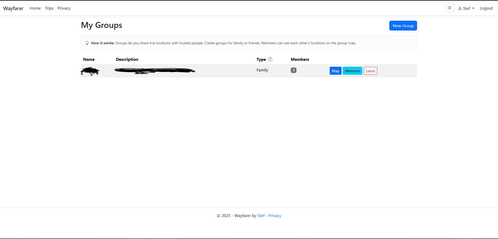

# Share locations with Groups

Use a Group to share live and historical locations with named Wayfarer users on
your instance. Join only when you are comfortable sharing with its members. Group
sharing is separate from making your [Timeline](timeline.md) public.

## Create or join a Group

Open **My Groups** from your name menu. Choose **New Group**, enter a name and
optional description, then select **Family** or **Friends** and create it.
Organization Groups are created through Manager or Admin tools; an ordinary User
can join one by invitation.

From the Group's **Members** page, an owner can search for an existing user by
username or display name and send an invitation. Invitations are handled inside
Wayfarer. The invited user opens **Invitations** and chooses **Accept** or
**Decline**. An accepted invitation adds that user to the Group; a pending,
expired or cancelled invitation does not grant membership.

Owners and permitted managers can review pending invitations and cancel those
that are no longer wanted. Mobile also lets you review and respond to invitations.

## Understand Group roles

These roles belong to the Group, independently of account roles:

| Group role | Responsibility |
| --- | --- |
| **Owner** | Own membership and Group management, invite or remove members, and manage Group settings. |
| **Manager** | Help manage invitations and members through the management tools; appointing managers is an owner's responsibility. |
| **Member** | View permitted Group locations, receive updates and leave the Group. |

Organization Groups retain an Owner or Manager to manage them. Wayfarer refuses a
membership change that would leave an occupied Organization without the required
management successor.

## Choose your sharing visibility

Every Group requires active membership to view or share locations:

| Group type | Who can see your locations? |
| --- | --- |
| **Family** | Every other active member. There is no personal opt-out. |
| **Friends** | Other active members while your personal sharing switch is on. |
| **Organization, sharing off** | Only you. This is the default. |
| **Organization, sharing on** | Other active members while your personal sharing switch is on. |

On the Group **Map**, use **Allow peers to see my locations** to hide your own
latest and historical locations in Friends or an Organization with sharing on.
You can still see your own records and other members who share. Group Owners and
Managers follow the same location visibility rules as everyone else.

Active Organization Group Owners and Managers can set **Enable peer location
sharing in this Organization Group** on the map, including through **My Groups**
when their account role is User. This switch applies only to that Group. Turning
it off hides all peer locations; turning it back on preserves each member's
personal opt-out. Organization Groups whose existing switch is off now enforce
self-only access; ask your Group's Owner or Manager about enabling sharing.

WayfarerMobile 1.3.0 offers the personal Organization sharing toggle when Group
sharing is on. Reload the Group after its policy changes to refresh that control.
Already viewed or downloaded locations may remain on an older or disconnected
client; changes prevent future authorized queries and live deliveries after they
are saved, and cannot remove copies someone already has.

Your public Timeline's private/public switch, delay and Hidden Areas do not govern
Group access. A Group can reveal locations that are absent from your public
Timeline, including recent locations and history. Turning off phone tracking
stops new automatic recordings, but does not remove locations already shared.

## Use the Group map

Choose **Map** from **My Groups**. The map shows permitted members' latest positions
and receives live updates while connected. Check timestamps: a last known location
does not guarantee somebody is still there.

Use member search, selection controls or **Only** to focus on a person. The
show/hide marker controls adjust your own display; they do not change who can see
your position. Use your Group's personal sharing control for that decision.

Switch day, month or year, choose a date and enable historical locations to review
past records. Larger date ranges may sample the display. Select a location to
inspect its time and details. [WayfarerMobile](mobile.md#follow-groups-and-live-updates)
provides a Group map on your phone too.

## Leave or remove membership

Choose **Leave** in **My Groups** when you no longer want to participate. An owner
leaving a Family or Friends Group transfers ownership to the next active member.
An Organization owner needs an eligible Manager successor while other members
remain. The Group is removed when its final active member leaves.

Owners and permitted managers can remove members through membership management.
Leaving or removal ends that membership's access and sharing through the Group;
it does not delete the person's own Timeline. Other members may still have copies
of information they saw, and your memberships in other Groups remain separate.

[User guide](index.md) · [Documentation home](../README.md)
