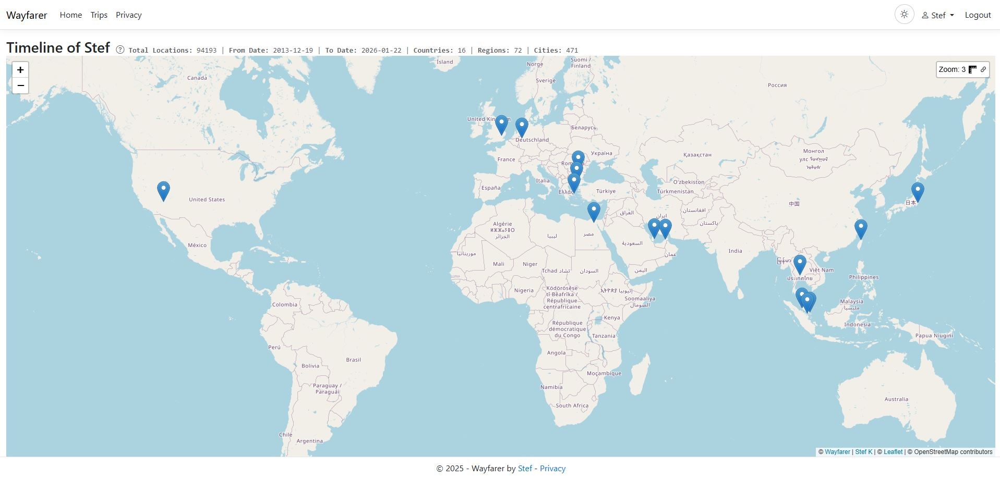

# Wayfarer user guide

Wayfarer is a travel companion for keeping a location journal, planning Trips and
sharing locations with people you trust. You use it through a web browser and,
optionally, the WayfarerMobile app. Your instance's server holds your authoritative
Wayfarer history; it may be run by you, a family member or an organization.

This guide helps you use an existing instance. You do not need to install the
server to follow it.

## Choose your next task

| I want to… | Guide |
| --- | --- |
| Explore location history by date and geography, or correct and share records | [Timeline and locations](timeline.md) |
| Plan destinations and review actual visits and Trip progress | [Trips](trips.md) |
| Share locations with trusted people and navigate toward a Group member | [Groups](groups.md) |
| Move phone or server history and Trip plans between files and apps | [Import and export](import-export.md) |
| Connect Mobile, a GPS logger or another app to record locations | [Connect apps to Wayfarer](connect-apps.md) |
| Record locations, navigate and use downloaded Trips offline on my phone | [WayfarerMobile](mobile.md) |
| Add optional address lookup, place search or generated routes | [Personal location providers](location-providers.md) |

## Get an account and sign in

Ask the person running your instance for its web address. Wayfarer has no single
global sign-in service: an account belongs to the instance where you created it.

If **Register** is available, you can create an account there. Otherwise, ask the
administrator to create one for you. Sign in with your username and password.
Registration does not require an email address or email verification, and password
recovery is handled by an administrator rather than an automated email reset.

Open your name menu and choose **My Account** to change your display name and
password. Change an initial password supplied by someone else. Production
instances require at least **15 characters**, including an uppercase letter,
a lowercase letter, a digit and a non-alphanumeric character.

### Protect your account with two-factor authentication

In **My Account > Two-factor authentication**, follow the authenticator setup,
scan the code in your authenticator app and enter its verification code. Save the
recovery codes somewhere secure outside the phone holding your authenticator.
You will need an authenticator code when signing in, or a recovery code if you
lose access to the authenticator.

A [connection token for apps](connect-apps.md) is a separate secret.
Treat it like a password even when your web sign-in uses two-factor authentication.

## Understand your role

Your account role determines which menus and tools are available.

| Role | What it is for |
| --- | --- |
| **User** | Keep a personal Timeline, plan Trips, report locations from Mobile and join or create sharing Groups. |
| **Manager** | Manage accounts and organized Groups through the Manager tools. |
| **Admin** | Manage the instance, its settings and accounts, including server-wide feature and capture limits. |

For personal location recording and planning, use an account with the **User**
role. An Admin or Manager role alone does not supply the personal User tools.
Group roles such as Owner and Member are separate from these account roles.

## Find your way around

Open your name menu to reach your personal tools:

- **Timeline** browses recorded locations by day, month or year.
- **My Private Timeline** shows your own history on a map. **Locations** combines
  a table and map; **All Locations** provides the searchable table.
- **Trips** holds plans made from Regions, Places, Areas and connecting Segments.
- **My Groups** and **Invitations** manage trusted location sharing.
- **Location imports** brings in history from files.
- **Settings** controls Timeline sharing and capture thresholds, and includes
  **Connect apps** and personal provider settings. **My Account** handles your profile, password and 2FA.

The top-level **Trips** link browses public Trips. Use **Trips** in your name menu
for your own plans. The theme switch changes the app's light or dark appearance.

## Make your first useful record or plan

1. Review **My Account**, change your initial password and set up 2FA.
2. Keep your Timeline private while you get familiar with it. Add a location from
   **All Locations**, [import existing history](import-export.md#import-location-history),
   or [connect Mobile, GPSLogger or another app](connect-apps.md) and record a point.
3. Open [Timeline](timeline.md) to find that location, inspect its details and add
   a note or activity.
4. Create a [Trip](trips.md), add a Region and a few Places, then connect them with
   a Segment. You can plan manually without a personal provider.
5. If you want to share, choose the audience deliberately: a trusted
   [Group](groups.md), a public Timeline or a public Trip.

## Choose what you share

Timelines and Trips are **private by default**. A public Timeline or Trip can be
viewed without signing in; publishing is not restricted to people who know you.
Before making a Timeline public, configure its delay and
[Hidden Areas](timeline.md#protect-sensitive-places-with-hidden-areas).

Joining a Group is a separate sharing decision. A private Timeline and Hidden
Areas do not hide your locations from the Group's permitted viewers. Read the
[Group visibility rules](groups.md#choose-your-sharing-visibility) before joining.

Your server operator controls the instance and its storage. Personal providers
are optional external services, and map tiles and external links can also involve
other services. See [provider privacy](location-providers.md#privacy-and-credentials)
and [Mobile privacy](mobile.md#privacy-and-security) for those boundaries.

## If you run the server

Use the [Self-hosting guide](../self-hosting/) and
[Operations](../self-hosting/operations.md) for installation, server operation and
recovery. For an account, connection or instance problem you cannot resolve here,
contact your administrator.

[Documentation home](../README.md)
