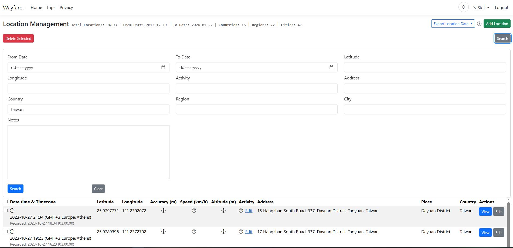
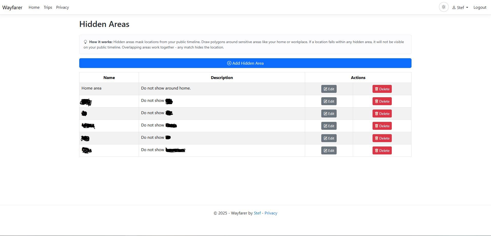

# Timeline and locations

Use your Timeline to explore where you have been, correct individual records and
choose what to share publicly. Each **Location** is one recorded position at a
particular time. Locations can come from Mobile tracking, manual check-ins, files
or entries you add in the web app.

Trips are plans rather than history. To plan destinations and record visits to
them, use the [Trips guide](trips.md).

## Browse your history

Open your name menu and choose the view that fits your task:

- **Timeline**: move between day, month and year views, pick a date or return to
  today.
- **My Private Timeline**: explore your own history on the map.
- **Locations**: work with a map and table together.
- **All Locations**: search the table, edit records and export history.

Pan and zoom to explore, then select a marker or table row for its details. Large
map views can show a sample of locations to remain readable; use the table and
filters when you need to find a particular record.

### Search and filter locations

Open **Search** in the Locations table. Combine a date range with activity,
address, country, region, city or text in notes. Latitude and longitude fields help
find records around a position. Choose **Search** to apply the filters and
**Clear** to remove them.

Locations retain their recorded time and local-time information when available.
Check the displayed timezone when comparing a phone record with a web record,
especially across travel or daylight-saving changes.

## Add or correct a location

1. Open **All Locations** and choose **Add Location**, or choose **Edit** for an
   existing record.
2. Set the coordinates and timestamp. Choose an activity and add notes if useful.
3. Review the address fields and save.

You can also change an activity from the location details or table without opening
the full form. Inline activity changes save when you select the new activity.

Address editing does not contact a provider. A manual correction becomes your own
address information. When you move a location, unchanged address information from
the old position is discarded rather than presented as an address for the new
coordinates. Review the address after changing coordinates.

Use **Bulk Edit Notes** from your name menu to update notes across matching
records. Review the matching records before applying the change. Deleting selected
locations removes history; export anything you need to keep first.

### Read location details

Details can include activity, notes, coordinates, address, accuracy, speed,
altitude, heading and source. Missing metadata means it was not available in that
record; it does not imply a zero value.

Some enriched locations show structured address components and a separate
**Nearby mapped feature**, **Mapped area** or **Mapped feature**. A nearby business
or building is context, not proof that you visited it. **Street address
unavailable** or **Address details unavailable** means the lookup did not supply
that detail; retained provider display text may still be shown.

The **Wiki** action looks for related Wikipedia articles. Opening an article
contacts Wikipedia. Optional address lookup and repair are explained in
[Personal location providers](location-providers.md#address-enrichment-controls).

## Understand your statistics

Timeline summaries show the number of locations, the first and last dates and
recorded countries, regions and settlements. Detailed statistics help you explore
those groups and navigate back to their locations.

Geographic counts depend on the address labels saved with each location. Different
spellings can split the same place, and missing labels are not invented. **Country
not recorded** and **Region not recorded** group records with missing parent
labels; they do not count as additional countries or regions.

Your private views summarize their own history or selected date period. Public
Timeline summaries cover all history eligible for public viewing, including the
delay and Hidden Areas rules. Moving or zooming the public map does not change
that full-history summary. A public Timeline with no eligible locations has zero
counts and no first or last date.

## Make your Timeline public deliberately

Your Timeline starts private. To publish it:

1. Open **Settings > Manage Timeline Settings**.
2. Optionally set a title, then enable **Make Timeline Public**.
3. Choose a **Time Threshold** and save.
4. Open the public link shown in **Settings**, preferably while signed out, to
   check what a visitor can see.

The threshold is a delay: **1 day** shows locations at least a day old. First-time
public sharing defaults to a one-day delay if you have not chosen one. **Now**
shares without a delay and requires explicit confirmation that your current
location will be publicly available.

Presets include one hour, day, week, month and year. For a custom delay, use a
number and unit: `h` hours, `d` days, `w` weeks, `m` months or `y` years. For example,
`6h`, `2w` or `1.5d`. Month and year delays are approximations of 30 and 365 days.
If settings report an invalid saved threshold, choose and save a valid one before
expecting public sharing to work.

Public details can expose precise positions, times, addresses, activities and
notes. A delay reduces immediacy but still reveals history and routines. Making
the Timeline private again stops public access through Wayfarer; it cannot recall
copies somebody has already saved.

## Protect sensitive places with Hidden Areas

Open **Hidden Areas** from your name menu. Add a named area and draw a polygon
around a sensitive location such as home or work. Save it, then check the public
Timeline. Edit the polygon if you need a wider boundary.

Locations within Hidden Areas are excluded from the public Timeline, its embed
and its public statistics. Overlapping areas work together. Deleting a Hidden
Area makes those records eligible for public viewing again, subject to the delay.

Hidden Areas do not delete records from your private history. They do not prevent
capture or provider address lookup, hide locations in trusted Groups, or hide
Places and visit progress in a public Trip. Set those sharing choices separately.

## Share a link or embed the Timeline

When your Timeline is public, **Settings** shows its public link and offers **Copy
embed URL** and **Copy embed HTML**. Open Wayfarer at the public HTTPS address
people will use before copying. Paste the generated iframe into your website;
adjust its height to fit the page.

The embed follows the same public visibility rules. Ordinary wheel scrolling and
single-finger swipes scroll the surrounding page. Use Ctrl + wheel (Cmd on macOS)
to zoom, mouse drag to pan, or two fingers to pan and zoom on touchscreens. **Open
full view** opens the regular public Timeline in a new tab.

For a copy of your history or to add older records, see
[Import and export](import-export.md). For sharing with named people, see
[Groups](groups.md).

[User guide](index.md) · [Documentation home](../README.md)
