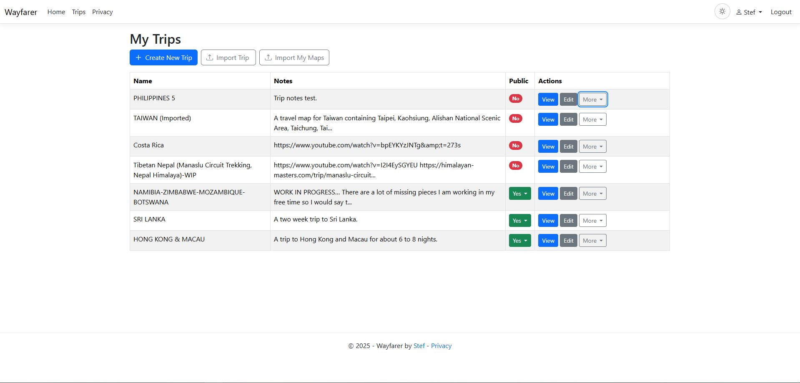
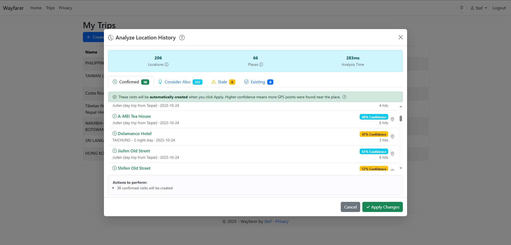

# Plan and use Trips

Use a Trip to organize destinations, draw routes, carry travel notes and review
which planned Places you visited. Create and edit the plan in the web app, then
view it there or take it with you in [WayfarerMobile](mobile.md). You can also
[make limited changes to your own Trip on the phone](mobile.md#edit-your-own-trip)
while traveling.

## Build a simple Trip

Open **Trips** from your name menu and choose **Create New Trip**. Give it a name
and save. New Trips are private. Add a description, tags or a cover image when
they help you recognize and organize the plan.

A Trip contains four kinds of content:

| Item | Use it for |
| --- | --- |
| **Region** | Group related content, such as a city or one stage of a journey. |
| **Place** | A destination at one position, with a name, notes and optional marker styling. |
| **Area** | A polygon marking a zone, boundary or area of interest. |
| **Segment** | A journey from one saved Place to another, optionally through intermediate Places, with a route and travel information. |

Start with a Region, add two Places, then connect them with a Segment. Add more
detail as you need it. An Area in a Trip is planning content; it does not have the
privacy effect of a Timeline Hidden Area.

## Add Places and Areas

In the editor, select a Region and add a Place. Pick its position on the map or
enter coordinates, then give it a useful name. Add notes, an icon and a color to
make the plan easier to read. The **Wiki** action helps you look up related
Wikipedia articles.

Map search runs when you submit a search. Choose a result and review its position
before using it. Search sends the query to an external service: configured,
verified Geoapify when available under its usage guard, or public Nominatim in
the supported fallback cases. Do not put confidential information into a search.
See [Trip search and providers](location-providers.md#trip-search) for the choice
and failure rules. Manual Place entry always remains available.

For an Area, draw the polygon on the map, name it and add notes or styling. Use it
to show a park, neighborhood or boundary rather than as a route between points.

## Set the map view people start with

Pan or zoom the map in normal navigation mode to capture a proposed default view.
Open **Edit Trip** and use **Save & Continue** or **Save & Exit** to save it. Moving
the map alone does not save the Trip's default view. You can also enter the center
and zoom in Trip settings.

**Fit All**, **Recenter Saved Trip View**, **Focus Active Entity**, Place selection
and search previews help you navigate without changing that default-view draft.
Drawing an Area or editing a route also leaves it unchanged. **Cancel / Reset**
discards the settings draft without moving the map.

The editor URL can preserve your current map view when shared or reopened. Opening
such a link does not overwrite the Trip's saved default. If you move the map while
a settings save is underway, a newer view can remain unsaved; the editor stays
open when another save is needed.

## Connect Places with Segments

Choose saved Places for **From** and **To**. Add saved **Intermediate places** in
the order you want to pass through them; these are the **Via** points of one
Segment. Use the move controls to reorder them.

A Via Place cannot repeat another Via or either endpoint. From and To may be the
same Place for a loop. For example, **Hotel → Museum → Market → Hotel** is one
Segment with two intermediate Places.

Choose a transport profile for planning and add notes. That choice describes the
journey and can supply an automatic planning speed. It does not choose an external
routing provider or its routing mode.

### Draw or change the route manually

From, every Via and To remain fixed route anchors. Add, move or remove route points
between those anchors to draw the path you want. Save the Segment to keep it.

**Clear Route** removes custom geometry while keeping the saved Place connections.
Wayfarer then connects all anchors in From/Via/To order. Those straight connections
are a planning fallback, not a calculated road route. Cloning and native Trip
exports preserve the ordered Places; see [Trip file compatibility](import-export.md#metadata-and-format-compatibility).

### Preview a provider-generated route

After [configuring a directions provider](location-providers.md#directions-and-routing),
select a supported provider mode under **External routed path** and choose
**Generate routed path**. Wayfarer shows a temporary dashed proposal with proposed
distance and estimated travel time.

Review the line, stops and estimates. **Save Segment** commits the generated route
together with your other Segment edits. **Discard proposal** removes the preview
and leaves the current route unchanged. Generating a preview alone does not replace
your saved route or ordinary draft fields.

If you have an explicit manual duration override, saving the proposal keeps that
duration. A failed save keeps the preview available for retry or discard. If the
proposal is no longer usable, discard it or explicitly generate a fresh one. You
can continue manual planning if the provider is unavailable or its guard is full.

### Read distance and duration

Distance is read-only. For manual routes it is calculated from the saved geometry,
or the ordered anchor connections when there is no custom geometry. A saved
provider route can retain the provider's distance and travel-time estimates.

**Use automatic estimate** calculates manual-plan duration using the selected
transport profile's planning speed. An incomplete route or missing planning speed
can leave that estimate unavailable. **Manual** lets you enter a duration, including
zero; it remains your choice when the route or profile changes until you explicitly
select automatic estimation again. Provider travel-time estimates and planning
estimates are guidance rather than a promised arrival time.

## Record and review visits

Plan Places, record locations with a [connected app](connect-apps.md) or a manual
entry, then review detected visits to compare the plan with your journey. Trip
progress shows visited and unvisited Places; visit history lets you inspect and
correct the evidence. For journeys already in your Timeline, use backfill below.

As location observations arrive, Wayfarer checks whether they are near your
planned Places. With default settings, two nearby observations within the detection
rules confirm a visit; they need not become two saved Timeline rows. Your
administrator controls detection settings. Sparse or inaccurate observations and
closely spaced Places can miss or misidentify a visit. Arrival, departure and
dwell time are inferred, and proximity does not prove that you entered a venue.

Open **Trip Visit History** from your name menu to search by Trip, Place, Region,
date or open/closed status. Review arrival, departure, dwell time and contributing
locations. You can edit or delete visits and follow their location records to
check the evidence. Visit records keep a snapshot of the Place even if the plan
changes later.

[Mobile visit alerts and spoken cues](mobile.md#visit-alerts-and-spoken-cues) can
help you notice detected arrivals while traveling. Review visits here when you
need to check the evidence or correct progress.

### Find visits in older history

Use **Backfill Visits** in the Trip's menu to analyze locations already in your
Timeline. Choose a date range if useful, then run the analysis. Review its tabs:

- **Confirmed**: matches that meet the detection requirements.
- **Consider Also**: possible visits with weaker or sparse location evidence.
- **Stale**: recorded visits whose Place was deleted or moved.
- **Existing**: visits already recorded for the Trip.

Select the additions or deletions you want. Open a row's context map to compare
the Place with contributing recordings, then review the action summary and choose
**Apply**. Analysis alone does not make those changes. Suggestions indicate
proximity; they do not establish that you entered a venue.

**Clear All Visits** removes the Trip's visit records. Use it only when you intend
to discard that progress; it does not remove your Timeline locations.

### Follow your progress

The Trip editor's progress header shows the visited count and percentage. Its
visit report can show all, visited or unvisited Places, with a Region breakdown
and visit details. Use these views while traveling or when reviewing the journey.

## Publish, embed or copy a Trip

Make a Trip public when you want visitors to read the plan without signing in.
Review its notes, Places and routes first. A public Trip can appear in discovery,
be copied by signed-in users and be retained in exported or downloaded files.

**Share Visit Progress** is a separate option for a public Trip. Enable it only
when you also want visitors to see your visits and journey progress. Public
Timeline delays and Hidden Areas do not protect this Trip content or progress.

Use the public sharing menu to copy a link, **Copy embed URL** or **Copy embed
HTML**. Copy at your instance's public HTTPS address. Trip embeds let ordinary
scrolling move the containing page; deliberate map gestures and **Open full view**
work as described in [Timeline embedding](timeline.md#share-a-link-or-embed-the-timeline).
Making the Trip private stops its public Wayfarer view but cannot recall copies.

Browse public Trips from the top-level **Trips** link. Search names and descriptions,
filter tags using all/any matching, and choose a sort or grid/list view. Sign in
with a User account to **Clone** a public Trip into your own plans. Edit your copy
independently; cloning does not change the original.

For KML imports, reusable exports and printable PDF guides, see
[Trip import and export](import-export.md#move-trip-plans).

[User guide](index.md) · [Documentation home](../README.md)
